# AI Management Centre — Artefact Architecture Description (AAD)

**Document Type**: Foundation Artefact — Wave 1 Deliverable  
**Status**: DRAFT — Awaiting CS2 Sign-Off  
**Version**: 0.1.0  
**Effective Date**: 2026-02-23  
**Owner**: Maturion Engineering Leadership (Johan Ras, CS2)  
**Location**: `governance/aimc/AIMC_ARTEFACT_ARCHITECTURE_DESCRIPTION.md`

**Authorities**:
- `governance/canon/AIMC_STRATEGY.md` v1.0.0 (Constitutional Canon)
- `governance/canon/LIVING_AGENT_SYSTEM.md` v6.2.0 (Constitutional Canon)

**Controlling Inputs**:
- `governance/aimc/AIMC_GOVERNANCE_REQUIREMENTS_SPECIFICATION.md` (GRS) — requirements source
- `governance/aimc/AIMC_AGENT_PROTOCOL_SPECIFICATION.md` (APS) — interface contracts source

**Feeds into**:
- Wave 2: Package Scaffold & Schema (builders implement the layout defined here)
- Step 6: RED Gate QA Suite (test scaffolding described in §9 is the RED gate input)

**Wave Gate**:
> This AAD is the Wave-2-start blocker alongside the GRS and APS. Wave 2 implementation MUST NOT begin until this document is CS2-signed-off, GRS is CS2-signed-off, and APS is CS2-signed-off.

---

## 1. Purpose of This Document

This Artefact Architecture Description (AAD) is the **fourth artefact** of the AIMC Wave 1 governance sequence (ACD → GRS → APS → AAD). It translates the formal requirements in the GRS and the interface contracts in the APS into a precise, file-by-file, module-by-module description of the `packages/ai-centre/` implementation target.

Where the GRS defines *what must be done* and the APS defines *what the interfaces look like*, the AAD defines *how the modules are structured*, *how they relate to one another*, and *how the architecture will be extended across subsequent waves without breaking existing behaviour*.

The AAD is the frozen architecture document that the Foreman MUST reference when issuing wave-start authorisations for Wave 2 and beyond. No builder agent may deviate from the layout and module responsibilities defined here without a CS2-approved AAD amendment.

---

## 2. Governing Principles

The following principles from `governance/canon/AIMC_STRATEGY.md` and the GRS govern every architectural decision in this document:

| Principle | Source | Architectural Impact |
|---|---|---|
| Modules declare WHAT; AIMC decides HOW | AIMC_STRATEGY.md §1 | All module-facing logic is encapsulated behind the single `AICentre` gateway class |
| No direct provider calls from modules | GRS-001, GRS-016 | Providers are internal to `packages/ai-centre/`; no SDK types are re-exported |
| Provider portability via adapter interface | GRS-005 | All provider integrations implement `ProviderAdapter`; gateway has zero provider-specific branching |
| Tenant isolation for all data | GRS-008 | Every Supabase query is scoped to `organisation_id`; enforced by RLS at the database layer |
| Immutable telemetry | GRS-013 | `TelemetryWriter` exposes only `write()`; no update or delete operations |
| Centralised persona governance | GRS-010, GRS-011 | Persona files live exclusively in `packages/ai-centre/agents/`; namespace segregation enforced at CI |
| Dependency injection throughout | APS §12 | `AICentre` accepts all collaborators via `AICentreConfig`; no constructor-internal construction |
| TypeScript strict compliance | GRS-026 | All source files compiled with `strict: true`; no `any` in public API surface |

---

## 3. High-Level Architecture

### 3.1 Internal Architecture Diagram

The following diagram shows the runtime call flow from a consuming module to the provider and back, with all internal modules in `packages/ai-centre/` visible.

```mermaid
graph TD
    subgraph ISMS_Module["ISMS Module (MAT / PIT / xDetect / etc.)"]
        M[Module code]
    end

    subgraph AICentre_Package["packages/ai-centre/"]
        GW["AICentre Gateway<br/>gateway/AICentre.ts"]

        subgraph Context_Assembly["Context Assembly"]
            PL["PersonaLoader<br/>personas/PersonaLoader.ts"]
            SMS["SessionMemoryStore<br/>memory/SessionMemoryStore.ts"]
            PMA["PersistentMemoryAdapter<br/>memory/PersistentMemoryAdapter.ts"]
            ML["MemoryLifecycle<br/>memory/MemoryLifecycle.ts"]
        end

        subgraph Routing["Capability Routing"]
            CR["CapabilityRouter<br/>routing/CapabilityRouter.ts"]
            PHR["ProviderHealthRegistry<br/>routing/ProviderHealthRegistry.ts"]
        end

        subgraph Adapters["Provider Adapters"]
            GMA["GitHubModelsAdapter<br/>(Wave 3)"]
            OAA["OpenAIAdapter<br/>(Wave 4)"]
            ANT["AnthropicAdapter<br/>(Wave 6)"]
            PXA["PerplexityAdapter<br/>(Wave 7)"]
            RWA["RunwayAdapter<br/>(Wave 8)"]
        end

        KS["ProviderKeyStore<br/>keys/ProviderKeyStore.ts"]
        TW["TelemetryWriter<br/>telemetry/TelemetryWriter.ts"]

        subgraph Agents_Dir["agents/ (Markdown only)"]
            PA["mat-advisor.md<br/>course-crafter-advisor.md<br/>xdetect-advisor.md<br/>risk-advisor.md"]
        end
    end

    subgraph Supabase["Supabase (external)"]
        MEM_TBL["ai_memory table"]
        TEL_TBL["ai_telemetry table"]
    end

    subgraph Provider_APIs["AI Provider APIs (external)"]
        GHAPI["GitHub Models API"]
        OAIAPI["OpenAI API"]
        ANTAPI["Anthropic API"]
        PXAPI["Perplexity API"]
        RWAPI["Runway API"]
    end

    M -- "ai.request(AICentreRequest)" --> GW
    GW -- "load persona" --> PL
    PL -- "reads" --> PA
    GW -- "retrieve persistent memory" --> PMA
    PMA -- "SELECT (org-scoped RLS)" --> MEM_TBL
    GW -- "retrieve session memory" --> SMS
    GW -- "resolve providers" --> CR
    CR -- "check health" --> PHR
    GW -- "execute(NormalisedProviderRequest)" --> GMA
    GW -- "execute(NormalisedProviderRequest)" --> OAA
    GW -- "execute(NormalisedProviderRequest)" --> ANT
    GW -- "execute(NormalisedProviderRequest)" --> PXA
    GW -- "execute(NormalisedProviderRequest)" --> RWA
    GMA -- "getKey()" --> KS
    OAA -- "getKey()" --> KS
    ANT -- "getKey()" --> KS
    PXA -- "getKey()" --> KS
    RWA -- "getKey()" --> KS
    GMA --> GHAPI
    OAA --> OAIAPI
    ANT --> ANTAPI
    PXA --> PXAPI
    RWA --> RWAPI
    GW -- "write(TelemetryEvent)" --> TW
    TW -- "INSERT (append-only)" --> TEL_TBL
    GW -- "recordTurn()" --> ML
    ML --> PMA
    ML --> SMS
    GW -- "AICentreResponse" --> M
```



### 3.2 Layered Module Map

```
┌─────────────────────────────────────────────────────────────────┐
│  Public API Layer                                               │
│  src/index.ts  ─  re-exports AICentre class + all public types  │
├─────────────────────────────────────────────────────────────────┤
│  Gateway Layer                                                  │
│  gateway/AICentre.ts  ─  orchestrates all subsystems            │
├──────────────────────┬──────────────────────────────────────────┤
│  Routing Subsystem   │  Context-Assembly Subsystem              │
│  routing/            │  memory/  +  personas/                   │
│  ├ CapabilityRouter  │  ├ SessionMemoryStore                     │
│  └ ProviderHealth    │  ├ PersistentMemoryAdapter                │
│    Registry          │  ├ MemoryLifecycle                        │
│                      │  └ PersonaLoader                          │
├──────────────────────┴──────────────────────────────────────────┤
│  Provider Adapter Layer                                         │
│  adapters/  ─  one file per provider; all implement same iface  │
├─────────────────────────────────────────────────────────────────┤
│  Cross-Cutting Concerns                                         │
│  keys/ProviderKeyStore  ─  telemetry/TelemetryWriter             │
├─────────────────────────────────────────────────────────────────┤
│  Type Definitions                                               │
│  types/index.ts  ─  all interfaces exported from APS §4–§9      │
├─────────────────────────────────────────────────────────────────┤
│  Data Layer (Supabase-owned)                                    │
│  supabase/migrations/  ─  ai_memory + ai_telemetry tables        │
├─────────────────────────────────────────────────────────────────┤
│  Static Content                                                 │
│  agents/  ─  plain Markdown persona files; loaded at runtime    │
└─────────────────────────────────────────────────────────────────┘
```

---

## 4. Directory and File-Level Layout

The canonical directory structure for `packages/ai-centre/` is defined below. Builders MUST follow this layout exactly; any deviation requires a CS2-approved AAD amendment.

```
packages/ai-centre/
├── src/
│   ├── index.ts                          # [PUBLIC API] Exports AICentre class and all public types
│   ├── gateway/
│   │   └── AICentre.ts                   # [GATEWAY] Main class; orchestrates all subsystems
│   ├── routing/
│   │   ├── CapabilityRouter.ts           # [ROUTING] Resolves ordered provider list per capability
│   │   └── ProviderHealthRegistry.ts     # [ROUTING] Tracks live health state per provider
│   ├── adapters/
│   │   ├── GitHubModelsAdapter.ts        # [ADAPTER] Wave 3 — advisory capability
│   │   ├── OpenAIAdapter.ts              # [ADAPTER] Wave 4 — analysis + embeddings capabilities
│   │   ├── AnthropicAdapter.ts           # [ADAPTER] Wave 6 — document-generation capability
│   │   ├── PerplexityAdapter.ts          # [ADAPTER] Wave 7 — deep-search capability
│   │   └── RunwayAdapter.ts              # [ADAPTER] Wave 8 — video-generation capability
│   ├── memory/
│   │   ├── SessionMemoryStore.ts         # [MEMORY] In-process session-scoped conversation history
│   │   ├── PersistentMemoryAdapter.ts    # [MEMORY] Supabase-backed cross-session memory (Wave 4)
│   │   └── MemoryLifecycle.ts            # [MEMORY] Orchestrates create/read/prune operations
│   ├── personas/
│   │   └── PersonaLoader.ts              # [PERSONA] Loads Markdown persona files by agentId
│   ├── telemetry/
│   │   └── TelemetryWriter.ts            # [TELEMETRY] Append-only writer to ai_telemetry table
│   ├── keys/
│   │   └── ProviderKeyStore.ts           # [KEYS] Reads provider API keys from environment secrets
│   └── types/
│       └── index.ts                      # [TYPES] All interface/enum/type definitions from APS §4–§9
├── agents/                               # [PERSONAS] Plain Markdown persona files (no code)
│   ├── mat-advisor.md                    # Wave 3
│   ├── course-crafter-advisor.md         # Wave 6
│   ├── xdetect-advisor.md                # Wave 7
│   └── risk-advisor.md                   # Wave 7
├── supabase/
│   └── migrations/                       # [SCHEMA] AIMC-owned Supabase migrations
│       ├── 001_ai_memory.sql             # ai_memory table + RLS policies
│       └── 002_ai_telemetry.sql          # ai_telemetry table + RLS policies (append-only)
├── package.json                          # Package manifest; name: @maturion/ai-centre
└── tsconfig.json                         # strict: true; no paths outside packages/ai-centre/src
```

> **Wave-by-wave delivery note**: Only the files required by the current wave need to exist at wave-start. Files scheduled for future waves (e.g., `AnthropicAdapter.ts`) MUST be stub files with a `throw new Error('Not implemented — Wave N')` body until their delivery wave. Stub files MUST satisfy the `ProviderAdapter` interface signature so that TypeScript compilation remains clean throughout. See §7 for the wave delivery schedule.

---

## 5. Module Responsibilities

This section describes the responsibility, key behaviour, and collaborators of every module in `packages/ai-centre/src/`.

### 5.1 `index.ts` — Public API Surface

**Responsibility**: Re-export the `AICentre` class and all public types. This is the *only* file that consuming modules see.

**Rules**:
- MUST NOT export any provider SDK types, internal implementation types, or Supabase client types.
- MUST NOT export React hooks, JSX, or any UI concern (GRS-018).
- MUST export all type definitions that a consumer needs to construct an `AICentreRequest` and interpret an `AICentreResponse` or `AICentreErrorResponse`.

**Exports** (per APS §4.1):
```
AICentre                  (class)
AICentreRequest           (interface)
AICentreResponse          (interface)
AICentreErrorResponse     (interface)
AICentreConfig            (interface)
Capability                (enum)
CapabilityResult          (type)
AICentreErrorCode         (enum)
```

---

### 5.2 `gateway/AICentre.ts` — Main Gateway Class

**Responsibility**: The single entry point for all AI capability requests. Orchestrates all subsystems end-to-end for every call.

**Key Behaviour** (per APS §12):
1. Accept a typed `AICentreRequest`.
2. Validate the request (unknown capability, unknown agent, missing required fields).
3. Invoke `PersonaLoader.load(request.agent)` to retrieve the system prompt.
4. Assemble the context window via `MemoryLifecycle` (see §5.7 for assembly order).
5. Call `CapabilityRouter.resolveProviders()` to obtain an ordered provider list.
6. Dispatch to the first healthy provider via its `ProviderAdapter.execute()` method.
7. On provider failure, iterate to the next provider; if all exhausted, return `ALL_PROVIDERS_UNAVAILABLE`.
8. After a successful response, call `MemoryLifecycle.recordTurn()` to persist the new turn.
9. Construct and write a `TelemetryEvent` via `TelemetryWriter.write()`.
10. Return a typed `AICentreResponse` or `AICentreErrorResponse`.

**Collaborators**: `PersonaLoader`, `MemoryLifecycle`, `CapabilityRouter`, `ProviderHealthRegistry`, `ProviderAdapter[]`, `TelemetryWriter`.

**Dependency Injection**: All collaborators MUST be injected via `AICentreConfig`. The constructor MUST NOT instantiate any collaborator itself. This makes the gateway fully testable with mock collaborators (see §8.2).

**Error Contract**: The gateway MUST NEVER propagate a raw provider error to the caller. All errors are wrapped in `AICentreErrorResponse` with a governed `AICentreErrorCode` (GRS-014).

---

### 5.3 `routing/CapabilityRouter.ts` — Capability Router

**Responsibility**: Given a capability and a health registry snapshot, determine the ordered list of provider names to attempt (primary first, then fallbacks).

**Key Behaviour** (per APS §5.1, §5.2):
- Reads `RoutingConfiguration.routes` to obtain the priority-ordered provider list for the requested capability.
- Filters the list by calling `ProviderHealthRegistry.getHealth()` and removing `UNAVAILABLE` providers.
- Returns the filtered, ordered list. If the list is empty (all providers unavailable), returns an empty array; the gateway then returns `ALL_PROVIDERS_UNAVAILABLE`.

**Configuration Source**: `RoutingConfiguration` is injected into the router at construction time. It MUST be loaded from an external, runtime-configurable source (environment variable or Supabase config table) — not hardcoded (GRS-004).

**Collaborators**: `ProviderHealthRegistry` (read-only).

---

### 5.4 `routing/ProviderHealthRegistry.ts` — Provider Health Registry

**Responsibility**: Track the current health state (`HEALTHY`, `DEGRADED`, `UNAVAILABLE`) for each registered provider, and update it based on observed request outcomes.

**Key Behaviour** (per APS §5.3):
- Maintains an in-process map of `ProviderName → ProviderHealthStatus`.
- `recordSuccess()` moves the provider toward `HEALTHY`.
- `recordFailure()` moves the provider toward `DEGRADED` or `UNAVAILABLE` depending on consecutive failure count.
- `getHealth()` returns the current status without side effects.

**Extension Point**: The registry implementation can be backed by a configurable circuit-breaker policy. Wave 2 delivers a simple in-process implementation; future waves may introduce distributed health state.

---

### 5.5 `adapters/` — Provider Adapters

**Responsibility**: Each adapter file wraps a single AI provider SDK into the `ProviderAdapter` interface (APS §6.1). The gateway interacts exclusively with the `ProviderAdapter` interface; no adapter implementation type is visible to any other module.

**Key Behaviour** (per APS §6.1):
- `execute(NormalisedProviderRequest)`: Constructs the provider-specific API payload from the normalised request, calls the provider API using a key from `ProviderKeyStore`, and maps the provider response to the typed `CapabilityResult`. Provider errors MUST be caught and wrapped in a `ProviderError` — never propagated raw (GRS-014).
- `healthCheck()`: Performs a lightweight probe of the provider endpoint. MUST complete within 5 seconds and MUST NOT consume billable quota.
- `supportedCapabilities`: Declares which `Capability` values this adapter handles.

**Per-Adapter Wave Schedule**:

| File | Provider | Wave | Capabilities |
|---|---|---|---|
| `GitHubModelsAdapter.ts` | GitHub Models | 3 | `advisory` |
| `OpenAIAdapter.ts` | OpenAI | 4 | `analysis`, `embeddings`, `image-generation` |
| `AnthropicAdapter.ts` | Anthropic | 6 | `document-generation` |
| `PerplexityAdapter.ts` | Perplexity | 7 | `deep-search` |
| `RunwayAdapter.ts` | Runway | 8 | `video-generation` |

**Wave 2 scaffold rule**: All five adapter files MUST exist from Wave 2, implementing the `ProviderAdapter` interface. Adapters not yet delivered throw `new Error('Not implemented — Wave N')` from `execute()` and return `ProviderHealthStatus.UNAVAILABLE` from `healthCheck()`.

**Extension Pattern**: Adding a new provider in a future wave requires:
1. A new file implementing `ProviderAdapter` (no changes to gateway or router).
2. Registration in `AICentreConfig.adapters`.
3. An entry in `RoutingConfiguration.routes` for the capability it handles.

---

### 5.6 `memory/SessionMemoryStore.ts` — Session Memory Store

**Responsibility**: Manage in-process, session-scoped conversation history for multi-turn advisory sessions.

**Key Behaviour** (per APS §7.1, GRS-007, GRS-031):
- `append(sessionId, turn)`: Appends a `MemoryTurn` to the session's history array.
- `getHistory(sessionId)`: Returns all turns in chronological order; empty array for unknown sessions.
- `prune(sessionId, maxTokenBudget)`: Removes the oldest turns until estimated token count fits within budget.
- `clearSession(sessionId)`: Explicitly releases session memory.

**Scope**: In-process only. Memory does not survive server restarts. Wave 4 introduces `PersistentMemoryAdapter` for cross-restart continuity.

**Thread Safety Note**: The Wave 2 implementation uses a simple `Map<string, MemoryTurn[]>`. If the server is multi-threaded (e.g., worker threads), a thread-safe implementation is required; the interface is unchanged.

---

### 5.7 `memory/PersistentMemoryAdapter.ts` — Persistent Memory Adapter

**Responsibility**: Read and write conversation memory to the `ai_memory` Supabase table, with strict `organisation_id` tenant isolation enforced at both the application layer and the database RLS layer (GRS-008).

**Key Behaviour** (per APS §7.2):
- `retrieve({ organisationId, sessionId?, limit? })`: Fetches memory entries, newest-first, filtered by `organisationId` (and optionally `sessionId`). The RLS policy on `ai_memory` provides a second enforcement layer.
- `persist(entry)`: Inserts a new memory entry tagged with `organisationId`.
- `pruneExpired(organisationId)`: Deletes expired entries for the organisation; called on a maintenance schedule.

**Wave Delivery**: Wave 4. In Wave 2–3, the `PersistentMemoryAdapter` is a stub that returns an empty array from `retrieve()` and no-ops on `persist()`.

---

### 5.8 `memory/MemoryLifecycle.ts` — Memory Lifecycle Orchestrator

**Responsibility**: Centralise all memory read/write/prune operations that the gateway invokes, and enforce the canonical context window assembly order.

**Context Window Assembly Order** (per APS §7.3, GRS-030):

| Order | Segment | Source | Notes |
|---|---|---|---|
| 1 | Persona system prompt | `PersonaLoader.load(agentId)` | Becomes `systemPrompt` in `NormalisedProviderRequest` |
| 2 | Persistent memory | `PersistentMemoryAdapter.retrieve()` scoped to `organisationId` | Newest-first; trimmed to token budget |
| 3 | Session memory | `SessionMemoryStore.getHistory()` scoped to `sessionId` | Chronological; trimmed to token budget |
| 4 | Domain knowledge | RAG pipeline (Wave 5+) | Semantic search results from pgvector |
| 5 | Current user input | `AICentreRequest.input.text` | Final message in context |

Segments 2–4 are assembled into `contextMessages: ContextMessage[]` in the order above. Segment 1 is passed as `systemPrompt`. Segment 5 is the final user message appended to `contextMessages`.

**Key Behaviour** (per APS §7.5):
- `recordTurn({ request, response })`: Called after every successful gateway response. Appends both the user turn and the assistant turn to session memory, then asynchronously persists to Supabase if `sessionId` is present.
- `pruneSession(sessionId)`: Called before context assembly to trim session memory to `maxContextTokens`.
- `pruneExpiredPersistentMemory(organisationId)`: Maintenance operation; should run on a daily schedule.

---

### 5.9 `personas/PersonaLoader.ts` — Persona Loader

**Responsibility**: Load persona files from `packages/ai-centre/agents/` by `agentId` and return the Markdown content as a string (GRS-010, GRS-028).

**Key Behaviour** (per APS §8.1):
- `load(agentId)`: Resolves `packages/ai-centre/agents/<agentId>.md` and returns the file content. Throws `PersonaNotFoundError` if the file does not exist.
- `listAvailable()`: Returns the set of `agentId` values for which persona files exist. Called at gateway startup for validation.

**Security Invariant**: `agentId` MUST be validated to reject any value containing `/`, `\`, or `..`. This prevents path traversal attacks. Any invalid `agentId` triggers an `AICentreErrorResponse` with `errorCode: UNKNOWN_AGENT`.

**Namespace Segregation**: The persona loader MUST only resolve paths under `packages/ai-centre/agents/`. It MUST NOT resolve paths under `.github/agents/` or any other directory (GRS-011).

---

### 5.10 `telemetry/TelemetryWriter.ts` — Telemetry Writer

**Responsibility**: Write `TelemetryEvent` records to the `ai_telemetry` Supabase table. The interface exposes only `write()` — no update or delete operations are possible (GRS-013).

**Key Behaviour** (per APS §9.2):
- `write(event)`: Inserts a new row into `ai_telemetry`. Returns the generated `id`.
- The backing table's RLS policy denies UPDATE and DELETE for all principals including organisation members, enforcing immutability at the database layer.

**Error Handling**: A `TelemetryWriter` failure MUST NOT cause the gateway to return an error to the caller. Telemetry write failures MUST be logged to the application error logger and the `errorCode` field populated in the `TelemetryEvent`, but the AI response has already been delivered at this point.

---

### 5.11 `keys/ProviderKeyStore.ts` — Provider Key Store

**Responsibility**: Provide provider API keys to adapter implementations. Keys MUST be loaded exclusively from CS2-managed environment secrets (GRS-015).

**Key Behaviour** (per APS §6.3):
- `getKey(provider)`: Returns the API key string for the given `ProviderName` from the process environment. Throws `ProviderKeyNotFoundError` if the key is absent.

**Security Invariant**: No adapter implementation MAY read an environment variable directly. All key access goes through `ProviderKeyStore.getKey()`. This enables the key store to be mocked in tests without setting real credentials (see §8.2).

---

### 5.12 `types/index.ts` — Type Definitions

**Responsibility**: Contain all TypeScript interface, enum, and type definitions described in APS §4–§9. This file is the single canonical source for all shared types within `packages/ai-centre/`.

**Rules**:
- MUST NOT contain any implementation logic — types and interfaces only.
- MUST be compiled with `strict: true`.
- All definitions MUST match the normative APS specifications exactly; no deviations.

---

## 6. Interface and Boundary Contracts

### 6.1 Public API Boundary

The public boundary of `packages/ai-centre/` is the set of exports from `src/index.ts`. This boundary MUST be stable across all waves — consuming modules import from `@maturion/ai-centre` and MUST NOT need to update their imports when new adapters or capabilities are added.

**Stability rule**: New capabilities are added by:
1. Extending the `Capability` enum with a new value.
2. Adding the corresponding `CapabilityResult` variant to the discriminated union.
3. Registering a new adapter.

No existing type signatures change. Consuming module code requires no modification unless it explicitly uses the new capability.

### 6.2 Module-to-Module Internal Boundaries

| Caller | Callee | Interface |
|---|---|---|
| `AICentre` (gateway) | `PersonaLoader` | `PersonaLoader` interface |
| `AICentre` (gateway) | `MemoryLifecycle` | `MemoryLifecycle` interface |
| `AICentre` (gateway) | `CapabilityRouter` | `CapabilityRouter` interface |
| `AICentre` (gateway) | `ProviderAdapter[]` | `ProviderAdapter` interface |
| `AICentre` (gateway) | `TelemetryWriter` | `TelemetryWriter` interface |
| `CapabilityRouter` | `ProviderHealthRegistry` | `ProviderHealthRegistry` interface |
| `MemoryLifecycle` | `SessionMemoryStore` | `SessionMemoryStore` interface |
| `MemoryLifecycle` | `PersistentMemoryAdapter` | `PersistentMemoryAdapter` interface |
| `ProviderAdapter` impl. | `ProviderKeyStore` | `ProviderKeyStore` interface |

Every internal boundary is mediated by an interface defined in `types/index.ts`. No concrete class is directly referenced by name outside its own file. This enables individual subsystems to be replaced or extended without cascading changes.

### 6.3 External System Boundaries

| Internal Module | External System | Protocol |
|---|---|---|
| `PersistentMemoryAdapter` | Supabase `ai_memory` | Supabase JS client; RLS enforced |
| `TelemetryWriter` | Supabase `ai_telemetry` | Supabase JS client; append-only RLS |
| `GitHubModelsAdapter` | GitHub Models REST API | HTTP; key via `ProviderKeyStore` |
| `OpenAIAdapter` | OpenAI REST API | HTTP; key via `ProviderKeyStore` |
| `AnthropicAdapter` | Anthropic REST API | HTTP; key via `ProviderKeyStore` |
| `PerplexityAdapter` | Perplexity REST API | HTTP; key via `ProviderKeyStore` |
| `RunwayAdapter` | Runway REST API | HTTP; key via `ProviderKeyStore` |

No module outside `packages/ai-centre/` may reference any of these external systems directly (GRS-016).

---

## 7. Wave-by-Wave Delivery Schedule

The following table maps each wave's deliverables to specific files in `packages/ai-centre/`. Only the files listed as "IMPLEMENT" for a given wave contain real implementation logic in that wave; all others in that wave remain stubs.

| Wave | Files to Implement | Files to Stub | Notes |
|---|---|---|---|
| **2** (Scaffold) | `src/index.ts`, `src/types/index.ts`, `src/gateway/AICentre.ts` (interface only), `supabase/migrations/001_ai_memory.sql`, `supabase/migrations/002_ai_telemetry.sql`, `package.json`, `tsconfig.json` | All adapter files, `memory/PersistentMemoryAdapter.ts`, `telemetry/TelemetryWriter.ts` | Full TypeScript interfaces; no live provider calls. All stubs must satisfy interface. |
| **3** (Gateway + Advisory) | `gateway/AICentre.ts` (full), `routing/CapabilityRouter.ts`, `routing/ProviderHealthRegistry.ts`, `memory/SessionMemoryStore.ts`, `memory/MemoryLifecycle.ts` (partial — session only), `personas/PersonaLoader.ts`, `adapters/GitHubModelsAdapter.ts`, `keys/ProviderKeyStore.ts`, `telemetry/TelemetryWriter.ts`, `agents/mat-advisor.md` | `adapters/OpenAIAdapter.ts`, `adapters/AnthropicAdapter.ts`, `adapters/PerplexityAdapter.ts`, `adapters/RunwayAdapter.ts`, `memory/PersistentMemoryAdapter.ts` | First live capability. MAT advisory end-to-end. |
| **4** (Analysis + Persistent Memory) | `adapters/OpenAIAdapter.ts` (analysis + embeddings), `memory/PersistentMemoryAdapter.ts`, `memory/MemoryLifecycle.ts` (full) | `adapters/AnthropicAdapter.ts`, `adapters/PerplexityAdapter.ts`, `adapters/RunwayAdapter.ts` | Tenant-isolated persistent memory active. |
| **5** (Knowledge + Embeddings + RAG) | `adapters/OpenAIAdapter.ts` (embeddings extension), RAG pipeline integration in `memory/MemoryLifecycle.ts` | `adapters/AnthropicAdapter.ts`, `adapters/PerplexityAdapter.ts`, `adapters/RunwayAdapter.ts` | Domain knowledge segment added to context assembly. |
| **6** (Document + Image Generation) | `adapters/AnthropicAdapter.ts`, `adapters/OpenAIAdapter.ts` (image-generation extension), `agents/course-crafter-advisor.md` | `adapters/PerplexityAdapter.ts`, `adapters/RunwayAdapter.ts` | Course Crafter persona active. |
| **7** (Deep Search + XDetect + Risk) | `adapters/PerplexityAdapter.ts`, `agents/xdetect-advisor.md`, `agents/risk-advisor.md` | `adapters/RunwayAdapter.ts` | XDetect and Risk advisor personas active. |
| **8** (Video + Algorithm + Certification) | `adapters/RunwayAdapter.ts`, `algorithm-execution` internal handler | None | All stubs replaced. Governance certification deliverable. |

---

## 8. Extension and Testability Patterns

### 8.1 Adding a New Provider (Extension Pattern)

To add a new AI provider in any wave:

1. Create `src/adapters/<ProviderName>Adapter.ts` implementing the `ProviderAdapter` interface.
2. Add the provider to the `ProviderName` enum in `src/types/index.ts`.
3. Add the capabilities it handles to `RoutingConfiguration.routes`.
4. Register the adapter instance in `AICentreConfig.adapters` at application bootstrap.
5. No changes to `AICentre.ts`, `CapabilityRouter.ts`, or any other module.

### 8.2 Testability via Dependency Injection

All subsystems are tested through the interfaces they expose. The `AICentreConfig` dependency injection contract (APS §12) enables the following test patterns:

| Test Scenario | Mock Injected |
|---|---|
| Gateway routes to fallback on primary failure | Inject a `ProviderAdapter` that throws on `execute()`, verify the second adapter is called |
| Persona not found returns UNKNOWN_AGENT error | Inject a `PersonaLoader` that throws `PersonaNotFoundError` |
| Telemetry written for every request | Inject a `TelemetryWriter` spy; assert `write()` called once per request |
| Tenant isolation enforced | Inject a `PersistentMemoryAdapter` spy; assert `retrieve()` always called with correct `organisationId` |
| Context window assembled in correct order | Inject controlled `SessionMemoryStore` and `PersistentMemoryAdapter`; capture `NormalisedProviderRequest.contextMessages` |
| API key never hardcoded | Inject a `ProviderKeyStore` mock that returns test tokens |
| All provider failures → ALL_PROVIDERS_UNAVAILABLE | Inject `ProviderHealthRegistry` that returns `UNAVAILABLE` for all providers |

No integration with real Supabase or real provider APIs is required for unit tests. Integration tests (using a real or local Supabase instance and governed mock provider endpoints) are a separate concern addressed in the Step 6 RED gate suite.

### 8.3 Adding a New Capability (Extension Pattern)

To add a new AI capability in a future wave:

1. Add a new value to the `Capability` enum.
2. Add the corresponding `CapabilityResult` variant to the discriminated union.
3. Implement or extend a `ProviderAdapter` to handle the new capability.
4. Add a route entry in `RoutingConfiguration.routes`.
5. Update `src/index.ts` to export any new public types.

All existing capabilities, adapters, and consuming module code remain unchanged.

---

## 9. Test Scaffolding for RED Gate Suite (Step 6)

This section defines the test scaffolding required for the RED gate QA suite (Step 6 of the AIMC implementation). These tests MUST be written before any Wave 2 implementation code, and all MUST fail (RED) at the time of writing.

### 9.1 Test File Layout

```
packages/ai-centre/
└── src/
    └── __tests__/
        ├── gateway/
        │   └── AICentre.test.ts          # Gateway orchestration tests
        ├── routing/
        │   ├── CapabilityRouter.test.ts
        │   └── ProviderHealthRegistry.test.ts
        ├── adapters/
        │   └── ProviderAdapter.contract.test.ts   # Contract tests (run against all adapters)
        ├── memory/
        │   ├── SessionMemoryStore.test.ts
        │   ├── PersistentMemoryAdapter.test.ts
        │   └── MemoryLifecycle.test.ts
        ├── personas/
        │   └── PersonaLoader.test.ts
        ├── telemetry/
        │   └── TelemetryWriter.test.ts
        └── keys/
            └── ProviderKeyStore.test.ts
```

### 9.2 Mandatory RED Tests by Module

The following test cases MUST be defined (failing RED) before Wave 2 implementation begins:

**`AICentre.test.ts`** (GRS-001, GRS-002, GRS-003, GRS-014):
- `request() returns AICentreResponse for a valid advisory request`
- `request() routes to fallback adapter when primary provider is UNAVAILABLE`
- `request() returns ALL_PROVIDERS_UNAVAILABLE when all providers are UNAVAILABLE`
- `request() returns UNKNOWN_AGENT when agentId does not match any persona file`
- `request() writes a TelemetryEvent for every call (success and failure)`
- `request() never exposes raw provider error messages in AICentreErrorResponse`
- `request() calls MemoryLifecycle.recordTurn() after every successful response`

**`CapabilityRouter.test.ts`** (GRS-003, GRS-004):
- `resolveProviders() returns providers in priority order for a healthy capability`
- `resolveProviders() excludes UNAVAILABLE providers from the returned list`
- `resolveProviders() returns empty array when all providers for a capability are UNAVAILABLE`

**`ProviderHealthRegistry.test.ts`** (GRS-014):
- `getHealth() returns HEALTHY for a newly registered provider`
- `recordFailure() transitions provider to DEGRADED after configured threshold`
- `recordFailure() transitions provider to UNAVAILABLE after sustained failures`
- `recordSuccess() transitions provider back toward HEALTHY`

**`ProviderAdapter.contract.test.ts`** (GRS-005, GRS-006):
- `execute() returns a CapabilityResult conforming to the declared capability` (parameterised per adapter)
- `execute() wraps provider errors in a governed ProviderError — no raw errors`
- `healthCheck() completes within 5000ms`
- `healthCheck() returns ProviderHealthStatus without consuming billable quota`

**`SessionMemoryStore.test.ts`** (GRS-007, GRS-031):
- `getHistory() returns empty array for an unknown sessionId`
- `append() adds a turn to the session in chronological order`
- `prune() removes oldest turns when token budget is exceeded`
- `clearSession() releases all memory for the session`

**`PersistentMemoryAdapter.test.ts`** (GRS-008):
- `retrieve() returns only entries belonging to the specified organisationId`
- `retrieve() returns empty array for an organisation with no persisted memory`
- `persist() stores the entry tagged with the correct organisationId`
- `pruneExpired() deletes entries past their expiresAt timestamp`

**`MemoryLifecycle.test.ts`** (GRS-030):
- `assembles context window with segments in the canonical order (persona, persistent, session, user input)`
- `recordTurn() appends user and assistant turns to session memory after a successful response`
- `pruneSession() trims session memory before context assembly`

**`PersonaLoader.test.ts`** (GRS-010, GRS-028, GRS-029):
- `load() returns the full Markdown content of a known agentId`
- `load() throws PersonaNotFoundError for an unknown agentId`
- `load() rejects agentId values containing path traversal sequences (/, \, ..)`
- `listAvailable() returns all agentIds with a corresponding .md file`

**`TelemetryWriter.test.ts`** (GRS-012, GRS-013):
- `write() returns the generated record id on success`
- `write() includes all required telemetry fields in the persisted record`
- No update or delete method exists on the TelemetryWriter interface (enforced by TypeScript type)

**`ProviderKeyStore.test.ts`** (GRS-015):
- `getKey() returns the key for a configured provider`
- `getKey() throws ProviderKeyNotFoundError when the key is absent from the environment`

---

## 10. GRS-to-Module Traceability

The following table maps every GRS requirement to its primary implementation module(s):

| GRS ID | Requirement Summary | Primary Module(s) |
|---|---|---|
| GRS-001 | Single gateway entry point | `gateway/AICentre.ts`, `index.ts` |
| GRS-002 | Typed request/response contract | `types/index.ts`, `gateway/AICentre.ts` |
| GRS-003 | Capability routing by type/cost/health | `routing/CapabilityRouter.ts` |
| GRS-004 | Governed routing configuration | `routing/CapabilityRouter.ts` (reads `RoutingConfiguration`) |
| GRS-005 | Provider adapter interface | `adapters/` (all adapter files), `types/index.ts` |
| GRS-006 | Progressive provider delivery (W3–W8) | `adapters/` (wave-staged delivery, see §7) |
| GRS-007 | In-process session memory | `memory/SessionMemoryStore.ts` |
| GRS-008 | Supabase persistent memory with org isolation | `memory/PersistentMemoryAdapter.ts`, `supabase/migrations/001_ai_memory.sql` |
| GRS-009 | No module-owned AI memory tables | `supabase/migrations/` (ownership boundary — enforced by governance review) |
| GRS-010 | Persona files in `packages/ai-centre/agents/` | `personas/PersonaLoader.ts`, `agents/` directory |
| GRS-011 | Namespace segregation app vs build personas | `personas/PersonaLoader.ts` (path validation), CI lint check |
| GRS-012 | Per-call telemetry event (required fields) | `telemetry/TelemetryWriter.ts`, `types/index.ts` (TelemetryEvent) |
| GRS-013 | Telemetry immutability | `telemetry/TelemetryWriter.ts`, `supabase/migrations/002_ai_telemetry.sql` (RLS) |
| GRS-014 | Graceful degradation / fallback | `gateway/AICentre.ts` (fallback loop), `routing/CapabilityRouter.ts` |
| GRS-015 | Central key management | `keys/ProviderKeyStore.ts` |
| GRS-016 | No direct provider calls from modules | Architectural boundary (no provider SDK exported from `index.ts`) |
| GRS-017 | Build-time agent orchestration exclusion | Architectural boundary (no LAS references in `packages/ai-centre/`) |
| GRS-018 | No UI/UX in AIMC package | `index.ts` (no React/JSX exports); enforced by CI lint |
| GRS-019 | Sequential wave gates | Governance process (Foreman wave-start authorisation) |
| GRS-020 | GRS+APS gate for Wave 2 | Governance process (this AAD is the Wave-2 architecture document) |
| GRS-021 | APS frozen gate for Wave 3 | Governance process |
| GRS-022 | Wave 8 governance certification | Wave 8 deliverable (out of scope for Wave 2) |
| GRS-023 | POLC governance for all waves | Governance process (Foreman) |
| GRS-024 | Artefact storage in `governance/aimc/` | This document's location |
| GRS-025 | Package at `packages/ai-centre/` | `package.json`, `tsconfig.json` |
| GRS-026 | TypeScript strict compliance | `tsconfig.json` (`strict: true`), all `src/` files |
| GRS-027 | Supabase migrations + RLS | `supabase/migrations/001_ai_memory.sql`, `supabase/migrations/002_ai_telemetry.sql` |
| GRS-028 | Persona loading by `agentId` | `personas/PersonaLoader.ts` |
| GRS-029 | Persona files as plain Markdown only | `agents/` directory (content rules); CI lint check |
| GRS-030 | Context window assembly order | `memory/MemoryLifecycle.ts` |
| GRS-031 | Memory lifecycle with PRUNE | `memory/SessionMemoryStore.ts`, `memory/MemoryLifecycle.ts` |

---

## 11. APS-to-Module Traceability

The following table maps each key APS section to its primary implementation module(s):

| APS Section | APS Element | Primary Module(s) |
|---|---|---|
| §4.1 | Entry Point Contract | `gateway/AICentre.ts`, `index.ts` |
| §4.2 | `AICentreRequest` schema | `types/index.ts` |
| §4.3 | `AICentreResponse` / `AICentreErrorResponse` schema | `types/index.ts`, `gateway/AICentre.ts` |
| §4.4 | `Capability` enum | `types/index.ts` |
| §4.5 | `CapabilityResult` discriminated union | `types/index.ts` |
| §5.1 | `CapabilityRouter` interface | `routing/CapabilityRouter.ts` |
| §5.2 | `RoutingConfiguration` | `routing/CapabilityRouter.ts` (reads config) |
| §5.3 | `ProviderHealthRegistry` interface | `routing/ProviderHealthRegistry.ts` |
| §6.1 | `ProviderAdapter` interface | `adapters/` (all adapter files) |
| §6.2 | Progressive provider schedule | `adapters/` (wave-staged) |
| §6.3 | `ProviderKeyStore` interface | `keys/ProviderKeyStore.ts` |
| §7.1 | `SessionMemoryStore` interface | `memory/SessionMemoryStore.ts` |
| §7.2 | `PersistentMemoryAdapter` interface | `memory/PersistentMemoryAdapter.ts` |
| §7.3 | Context window assembly protocol | `memory/MemoryLifecycle.ts` |
| §7.4 | Supabase schema (`ai_memory`, `ai_telemetry`) | `supabase/migrations/001_ai_memory.sql`, `supabase/migrations/002_ai_telemetry.sql` |
| §7.5 | `MemoryLifecycle` interface | `memory/MemoryLifecycle.ts` |
| §8.1 | `PersonaLoader` interface | `personas/PersonaLoader.ts` |
| §8.2 | Namespace segregation rule | `personas/PersonaLoader.ts` (path validation), CI lint |
| §8.3 | Persona file format rules | `agents/` directory (content rules) |
| §9.1 | `TelemetryEvent` schema | `types/index.ts` |
| §9.2 | `TelemetryWriter` interface | `telemetry/TelemetryWriter.ts` |
| §10 | Wave gate protocol | Governance process (Foreman) |
| §11 | Directory layout | This AAD §4 (canonical layout) |
| §12 | `AICentre` class and `AICentreConfig` | `gateway/AICentre.ts` |

---

## 12. Configuration and Environment

### 12.1 `AICentreConfig` — Dependency Injection Root

At application bootstrap, the consumer module (or a shared ISMS initialisation module) constructs an `AICentre` instance by assembling an `AICentreConfig` object. All subsystem implementations are provided here. The gateway has no side-effectful construction logic.

Example bootstrap pattern (non-normative — exact wiring is the Wave 2 scaffold task):

```typescript
const aiCentre = new AICentre({
  routing: loadRoutingConfigFromEnvironment(),
  keyStore: new ProviderKeyStore(),
  telemetryWriter: new SupabaseTelemetryWriter(supabaseClient),
  persistentMemory: new SupabasePersistentMemoryAdapter(supabaseClient),
  sessionMemory: new InMemorySessionMemoryStore(),
  personaLoader: new FileSystemPersonaLoader(),
  healthRegistry: new InProcessProviderHealthRegistry(),
  adapters: [
    new GitHubModelsAdapter(),        // Wave 3
    new OpenAIAdapter(),              // Wave 4 (stub in Wave 2–3)
    new AnthropicAdapter(),           // Wave 6 (stub in Wave 2–5)
    new PerplexityAdapter(),          // Wave 7 (stub in Wave 2–6)
    new RunwayAdapter(),              // Wave 8 (stub in Wave 2–7)
  ],
});
```

### 12.2 Environment Variables

All provider API keys are read from process environment variables by `ProviderKeyStore`. The canonical environment variable names are:

| Provider | Environment Variable |
|---|---|
| GitHub Models | `GITHUB_MODELS_API_KEY` |
| OpenAI | `OPENAI_API_KEY` |
| Anthropic | `ANTHROPIC_API_KEY` |
| Perplexity | `PERPLEXITY_API_KEY` |
| Runway | `RUNWAY_API_KEY` |

These names are defined here as the canonical set. No other naming convention may be used. CS2 manages the values in the Vercel / CI secret stores.

---

## 13. Future Wave Adaptation Statement

The architecture defined in this AAD is explicitly designed for incremental, non-breaking expansion across eight waves. The following invariants guarantee that future-wave additions do not require breaking changes to existing consumers:

1. **The `Capability` enum is additive only.** New values are added; existing values are never removed or renamed without a major version bump and a CS2 amendment.
2. **The `CapabilityResult` discriminated union is additive only.** New variants are added; existing variants are frozen once delivered.
3. **Provider adapters are self-contained.** No gateway or router code changes when a new adapter is registered. Routing configuration changes are operational, not code changes.
4. **All interfaces are stable across waves.** Internal implementations may be replaced (e.g., `PersistentMemoryAdapter` stub → real implementation in Wave 4) without changing the interface signature.
5. **Wave 5 RAG pipeline adds a new segment (segment 4) to context assembly.** The `MemoryLifecycle` implementation adds this segment; the `AICentre` gateway interface is unchanged.
6. **The `AICentreConfig` contract is additive.** New optional config fields may be added in future waves without breaking existing bootstrap code.

---

## 14. References

| Document | Location | Role |
|---|---|---|
| ACD — Capability Description | `governance/aimc/AIMC_CAPABILITY_DESCRIPTION.md` | Foundation scope document; establishes in/out-of-scope boundaries |
| GRS — Governance Requirements Specification | `governance/aimc/AIMC_GOVERNANCE_REQUIREMENTS_SPECIFICATION.md` | Requirements source; all GRS requirements mapped in §10 |
| APS — Agent & Protocol Specification | `governance/aimc/AIMC_AGENT_PROTOCOL_SPECIFICATION.md` | Interface contracts source; all APS sections mapped in §11 |
| `AIMC_STRATEGY.md` v1.0.0 | `governance/canon/AIMC_STRATEGY.md` | Constitutional authority for architecture, provider strategy, and governance principles |
| `LIVING_AGENT_SYSTEM.md` v6.2.0 | `governance/canon/LIVING_AGENT_SYSTEM.md` | Living Agent framework; governs build agents implementing the AIMC |
| `MEMORY_INTEGRITY_AND_CORRUPTION_MODEL.md` | `governance/canon/MEMORY_INTEGRITY_AND_CORRUPTION_MODEL.md` | Constitutional authority for Memory Centre design |
| `THREE_TIER_AGENT_KNOWLEDGE_ARCHITECTURE.md` | `governance/canon/THREE_TIER_AGENT_KNOWLEDGE_ARCHITECTURE.md` | Knowledge management; governs RAG pipeline design (Wave 5) |
| `WAVE_MODEL.md` | `governance/canon/WAVE_MODEL.md` | Wave model governing the 8-wave implementation sequence |

---

## 15. Acceptance Criteria

This AAD is complete and ready for CS2 sign-off when all of the following are satisfied:

- [x] File exists at `governance/aimc/AIMC_ARTEFACT_ARCHITECTURE_DESCRIPTION.md`
- [x] GRS and APS are listed as controlling inputs
- [x] Directory and file-level layout for `packages/ai-centre/` is defined (§4)
- [x] All major internal modules are described with responsibility, key behaviour, and collaborators (§5)
- [x] Internal architecture diagram (Mermaid) is included (§3.1)
- [x] Layered module map (ASCII) is included (§3.2)
- [x] All module-to-module internal boundaries are documented via interfaces (§6.2)
- [x] All external system boundaries are documented (§6.3)
- [x] GRS-to-module traceability table is complete — all 31 GRS requirements mapped (§10)
- [x] APS-to-module traceability table is complete — all APS sections mapped (§11)
- [x] Extension patterns for new providers and new capabilities are documented (§8.1, §8.3)
- [x] Testability patterns via dependency injection are documented (§8.2)
- [x] RED gate test scaffolding is specified with test file layout and mandatory test cases per module (§9)
- [x] Public API, DI, and configuration handling are described (§6.1, §12)
- [x] Wave adaptation statement confirms non-breaking extension across 8 waves (§13)
- [x] Wave-by-wave delivery schedule maps each wave to specific files (§7)
- [ ] CS2 review and sign-off received

---

*End of Document*

**Authority**: `governance/canon/AIMC_STRATEGY.md` v1.0.0 | `governance/canon/LIVING_AGENT_SYSTEM.md` v6.2.0  
**Controlling Inputs**: `governance/aimc/AIMC_GOVERNANCE_REQUIREMENTS_SPECIFICATION.md` | `governance/aimc/AIMC_AGENT_PROTOCOL_SPECIFICATION.md`  
**Drafted**: 2026-02-23  
**Next Action**: CS2 review → sign-off → Wave 2 start
