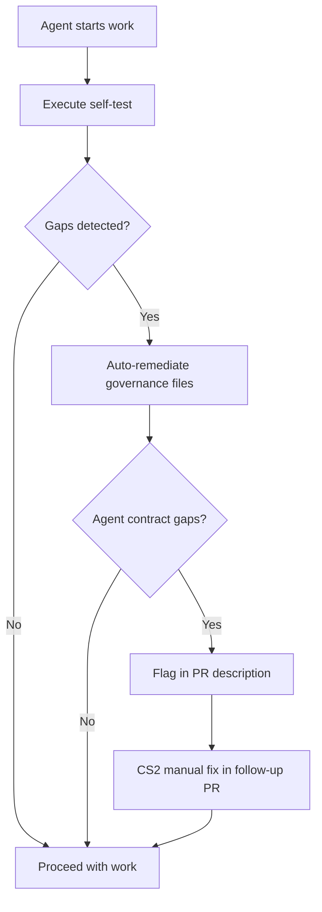

# PRE-WORK GOVERNANCE SELF-TEST PROTOCOL

## Status
**Type**: Canonical Governance Process — Mandatory Enforcement  
**Authority**: Supreme - Canonical  
**Version**: 1.0.0  
**Effective Date**: 2026-02-04  
**Owner**: Maturion Engineering Leadership (Johan Ras)  
**Precedence**: Subordinate to GOVERNANCE_PURPOSE_AND_SCOPE.md, extends AGENT_SELF_GOVERNANCE_PROTOCOL.md

---

## 1. Purpose

This protocol establishes **mandatory pre-work governance self-test and gap detection** for ALL agents before starting any new job, issue, or pull request. It prevents governance drift by:

1. **Detecting gaps** - Comparing local governance to canonical requirements matrix
2. **Auto-remediation** - Layering down missing governance artifacts (where possible)
3. **Flagging gaps** - Documenting agent contract gaps for CS2 manual fix (bootstrap phase)
4. **Preventing work** - Blocking agent work if critical governance is missing

**Problem Addressed**: Agents frequently begin work without verifying they have current governance, leading to:
- Execution with outdated protocols
- Missing mandatory LOCKED sections in agent contracts
- Inconsistent enforcement across repositories
- Manual detection of gaps after work is complete

**Solution**: Universal pre-work self-test that runs automatically before every agent job, detects gaps, auto-remediates where possible, and escalates remaining gaps.

**Constitutional Basis**:
- **AGENT_SELF_GOVERNANCE_PROTOCOL.md** — Universal agent self-check obligation
- **GOVERNANCE_AGENT_REQUIREMENTS_MATRIX.md** — Canonical requirements reference
- **GOVERNANCE_RIPPLE_MODEL.md** — Layer-down propagation requirements
- **EXECUTION_BOOTSTRAP_PROTOCOL.md** — Zero-warning enforcement
- **Issue #999** — Inventory and tracking mandate

---

## 2. Constitutional Authority

This protocol derives authority from:
- **GOVERNANCE_PURPOSE_AND_SCOPE.md** — Supreme governance authority
- **AGENT_SELF_GOVERNANCE_PROTOCOL.md** — Agent self-governance obligations
- **AGENT_CONTRACT_PROTECTION_PROTOCOL.md** — Contract integrity requirements
- **EXECUTION_BOOTSTRAP_PROTOCOL.md** — Execution verification requirements
- **STOP_AND_FIX_DOCTRINE.md** — Immediate issue remediation
- **Issue #999** — Inventory mandate (Issue tracker reference)

---

## 3. Scope

### 3.1 Mandatory Application

This protocol MUST be executed by:

✅ **All agent types**:
- Foreman (FM)
- Builder
- Governance-Liaison
- Governance-Repo-Administrator
- CodexAdvisor
- Assurance (post-launch)

✅ **Before every execution context**:
- New issue assignment
- New PR creation
- Job resumption after interruption
- Daily work session start
- After canonical governance update notification

### 3.2 Exemptions

This protocol is NOT required for:
- Read-only operations (viewing files, reading issues)
- Emergency hotfix approvals (CS2 discretion)
- Governance-repo-administrator when executing self-governance check itself (avoid infinite recursion)

**When uncertain, execute the self-test.**

---

## 4. The Pre-Work Self-Test Checklist

This checklist MUST be executed sequentially before starting work.

### Step 1: Verify Agent Identity and Contract

**Action**: Confirm agent identity and locate agent contract.

```bash
# Example for governance-liaison
echo "🔍 Step 1: Verifying agent identity..."
AGENT_ID="governance-liaison"
CONTRACT_PATH=".github/agents/${AGENT_ID}.agent.md"

if [ -f "$CONTRACT_PATH" ]; then
  echo "✅ Step 1: Agent contract found at $CONTRACT_PATH"
else
  echo "❌ Step 1: FATAL - Agent contract not found"
  exit 1
fi
```

**Success Criteria**: Agent contract file exists and is readable.

**Failure Action**: HALT - Agent cannot operate without contract. Escalate to CS2.

---

### Step 2: Check Canonical Source Status

**Action**: Verify local governance is synced with canonical source.

```bash
echo "🔍 Step 2: Checking canonical governance status..."

# Check GOVERNANCE_INVENTORY.json exists
if [ -f "GOVERNANCE_INVENTORY.json" ]; then
  LAST_SYNC=$(jq -r '.last_sync' GOVERNANCE_INVENTORY.json)
  CANONICAL_SHA=$(jq -r '.canonical_source.commit_sha' GOVERNANCE_INVENTORY.json)
  echo "✅ Step 2: Last sync: $LAST_SYNC (SHA: ${CANONICAL_SHA:0:8})"
else
  echo "⚠️ Step 2: GOVERNANCE_INVENTORY.json not found (first-time setup)"
  echo "ℹ️ Will create inventory in Step 4"
fi
```

**Success Criteria**: Inventory exists and shows recent sync (< 30 days).

**Warning Action**: If sync > 30 days, flag for governance-liaison to update.

---

### Step 3: Execute Gap Analysis

**Action**: Run governance gap analyzer to detect missing artifacts.

```bash
echo "🔍 Step 3: Executing gap analysis..."

# Run gap analyzer script
if [ -x ".github/scripts/governance-gap-analyzer.sh" ]; then
  bash .github/scripts/governance-gap-analyzer.sh \
    --agent-id "$AGENT_ID" \
    --mode pre-work \
    --output governance/reports/gap-analysis-$(date +%Y%m%d-%H%M%S).md
  
  GAP_EXIT_CODE=$?
  
  if [ $GAP_EXIT_CODE -eq 0 ]; then
    echo "✅ Step 3: No mandatory gaps detected"
  elif [ $GAP_EXIT_CODE -eq 1 ]; then
    echo "⚠️ Step 3: Recommended gaps detected (non-blocking)"
  elif [ $GAP_EXIT_CODE -eq 2 ]; then
    echo "❌ Step 3: MANDATORY gaps detected (blocking)"
  else
    echo "❌ Step 3: Gap analysis failed"
    exit 1
  fi
else
  echo "❌ Step 3: Gap analyzer script not found"
  echo "ℹ️ Falling back to manual verification"
  GAP_EXIT_CODE=0
fi
```

**Success Criteria**: Exit code 0 (no mandatory gaps) or 1 (recommended gaps only).

**Failure Action**: If exit code 2, proceed to Step 4 for auto-remediation. If script missing, escalate to CS2.

---

### Step 4: Auto-Remediation (If Gaps Detected)

**Action**: Attempt to auto-layer-down missing governance artifacts.

```bash
if [ $GAP_EXIT_CODE -eq 2 ]; then
  echo "🔍 Step 4: Attempting auto-remediation..."
  
  # Run gap analyzer in remediation mode
  bash .github/scripts/governance-gap-analyzer.sh \
    --agent-id "$AGENT_ID" \
    --mode remediate \
    --auto-layer-down
  
  REMEDIATION_EXIT_CODE=$?
  
  if [ $REMEDIATION_EXIT_CODE -eq 0 ]; then
    echo "✅ Step 4: All gaps remediated successfully"
  else
    echo "⚠️ Step 4: Partial remediation - agent contract gaps remain"
    echo "ℹ️ Agent contract gaps require CS2 manual fix (bootstrap phase)"
  fi
else
  echo "ℹ️ Step 4: No remediation required (no mandatory gaps)"
fi
```

**Success Criteria**: All missing governance files layered down, inventory updated.

**Partial Success**: Governance files layered down, but agent contract bindings require manual CS2 update.

**Failure Action**: Document remaining gaps in PR, continue to Step 5.

---

### Step 5: Verify Agent Contract Bindings

**Action**: Verify agent contract has required governance bindings.

```bash
echo "🔍 Step 5: Verifying agent contract bindings..."

# Check for mandatory bindings based on agent type
REQUIRED_BINDINGS=(
  "governance-purpose"
  "build-philosophy"
  "execution-bootstrap"
  "stop-and-fix"
  "agent-protection"
  "agent-self-governance"
  "pre-work-protocol"
)

MISSING_BINDINGS=()

for binding_id in "${REQUIRED_BINDINGS[@]}"; do
  if ! grep -q "id: $binding_id" "$CONTRACT_PATH"; then
    MISSING_BINDINGS+=("$binding_id")
  fi
done

if [ ${#MISSING_BINDINGS[@]} -eq 0 ]; then
  echo "✅ Step 5: All mandatory bindings present"
else
  echo "⚠️ Step 5: Missing bindings detected:"
  for binding in "${MISSING_BINDINGS[@]}"; do
    echo "  - $binding"
  done
  echo "ℹ️ Flagging for CS2 manual fix (bootstrap phase)"
fi
```

**Success Criteria**: All mandatory bindings present per GOVERNANCE_AGENT_REQUIREMENTS_MATRIX.md.

**Failure Action**: Document missing bindings in PR description, flag for CS2 manual fix, proceed with work.

---

### Step 6: Verify LOCKED Sections Presence

**Action**: Verify required LOCKED sections exist in agent contract.

```bash
echo "🔍 Step 6: Verifying LOCKED sections..."

# Check for mandatory LOCKED sections
REQUIRED_LOCKED_SECTIONS=(
  "Pre-Job Self-Governance"
  "Zero-Warning Handover Enforcement"
  "Pre-Handover Validation"
  "Merge Gates"
)

MISSING_LOCKED_SECTIONS=()

for section in "${REQUIRED_LOCKED_SECTIONS[@]}"; do
  if ! grep -q "## 🔒 $section" "$CONTRACT_PATH"; then
    MISSING_LOCKED_SECTIONS+=("$section")
  fi
done

if [ ${#MISSING_LOCKED_SECTIONS[@]} -eq 0 ]; then
  echo "✅ Step 6: All mandatory LOCKED sections present"
else
  echo "⚠️ Step 6: Missing LOCKED sections detected:"
  for section in "${MISSING_LOCKED_SECTIONS[@]}"; do
    echo "  - $section"
  done
  echo "ℹ️ Flagging for CS2 manual fix (bootstrap phase)"
fi
```

**Success Criteria**: All mandatory LOCKED sections present per AGENT_CONTRACT_PROTECTION_PROTOCOL.md.

**Failure Action**: Document missing LOCKED sections in PR description, flag for CS2 manual fix, proceed with work.

---

### Step 7: Update Governance Inventory

**Action**: Update GOVERNANCE_INVENTORY.json with self-test results.

```bash
echo "🔍 Step 7: Updating governance inventory..."

# Update inventory with self-test timestamp
if [ -f "GOVERNANCE_INVENTORY.json" ]; then
  jq --arg timestamp "$(date -u +%Y-%m-%dT%H:%M:%SZ)" \
     '.gap_summary.last_gap_analysis = $timestamp' \
     GOVERNANCE_INVENTORY.json > GOVERNANCE_INVENTORY.json.tmp
  mv GOVERNANCE_INVENTORY.json.tmp GOVERNANCE_INVENTORY.json
  echo "✅ Step 7: Inventory updated"
else
  echo "⚠️ Step 7: Inventory will be created by governance-liaison"
fi
```

**Success Criteria**: Inventory updated with latest gap analysis timestamp.

**Failure Action**: If inventory missing, flag for governance-liaison to create, proceed with work.

---

### Step 8: Document Self-Test Attestation

**Action**: Generate self-test attestation for PR description or PREHANDOVER_PROOF.

```bash
echo "🔍 Step 8: Generating self-test attestation..."

cat > /tmp/self-test-attestation.md <<ATTESTATION
### Pre-Work Governance Self-Test ✅
- [x] Agent identity verified: $AGENT_ID
- [x] Agent contract found: $CONTRACT_PATH
- [x] Canonical governance status checked
- [x] Gap analysis executed: $([ $GAP_EXIT_CODE -eq 0 ] && echo "No gaps" || echo "Gaps detected")
- [x] Auto-remediation attempted: $([ $GAP_EXIT_CODE -eq 2 ] && echo "Yes" || echo "Not required")
- [x] Agent contract bindings verified: $([ ${#MISSING_BINDINGS[@]} -eq 0 ] && echo "Complete" || echo "${#MISSING_BINDINGS[@]} missing")
- [x] LOCKED sections verified: $([ ${#MISSING_LOCKED_SECTIONS[@]} -eq 0 ] && echo "Complete" || echo "${#MISSING_LOCKED_SECTIONS[@]} missing")
- [x] Governance inventory updated

**Timestamp**: $(date -u +%Y-%m-%dT%H:%M:%SZ)

$(if [ ${#MISSING_BINDINGS[@]} -gt 0 ] || [ ${#MISSING_LOCKED_SECTIONS[@]} -gt 0 ]; then
  echo "**⚠️ Agent Contract Gaps Detected (Bootstrap Phase)**"
  echo "The following gaps require CS2 (Johan Ras) manual fix:"
  [ ${#MISSING_BINDINGS[@]} -gt 0 ] && echo "- Missing bindings: ${MISSING_BINDINGS[*]}"
  [ ${#MISSING_LOCKED_SECTIONS[@]} -gt 0 ] && echo "- Missing LOCKED sections: ${MISSING_LOCKED_SECTIONS[*]}"
  echo ""
  echo "**Action**: CS2 will update agent contract in follow-up PR per AGENT_CONTRACT_PROTECTION_PROTOCOL.md"
fi)
ATTESTATION

echo "✅ Step 8: Self-test attestation generated at /tmp/self-test-attestation.md"
```

**Success Criteria**: Attestation file created with complete self-test results.

**Failure Action**: If attestation cannot be created, document manually in PR description.

---

### Step 9: Proceed or Escalate Decision

**Action**: Determine if work can proceed or must be escalated.

```bash
echo "🔍 Step 9: Proceed or escalate decision..."

CRITICAL_BLOCK=false

# Block if mandatory governance files missing AND auto-remediation failed
if [ $GAP_EXIT_CODE -eq 2 ] && [ $REMEDIATION_EXIT_CODE -ne 0 ]; then
  if [ ${#MISSING_BINDINGS[@]} -gt 0 ]; then
    # Check if any missing bindings are CRITICAL
    for binding in "${MISSING_BINDINGS[@]}"; do
      case $binding in
        "execution-bootstrap"|"stop-and-fix"|"agent-protection")
          CRITICAL_BLOCK=true
          ;;
      esac
    done
  fi
fi

if [ "$CRITICAL_BLOCK" = true ]; then
  echo "❌ Step 9: CRITICAL governance missing - HALT work"
  echo "ℹ️ Escalate to CS2 immediately"
  echo "ℹ️ Cannot proceed without critical governance"
  exit 1
else
  echo "✅ Step 9: Proceeding with work"
  echo "ℹ️ Non-critical gaps will be flagged in PR for CS2 remedy"
fi
```

**Success Criteria**: Either no gaps, or only non-critical gaps that don't block work.

**Failure Action**: HALT work, escalate to CS2 with full gap analysis report, exit with non-zero code.

---

## 5. Exit Codes

The self-test protocol uses standardized exit codes:

| Exit Code | Meaning | Action |
|-----------|---------|--------|
| **0** | ✅ Pass - No gaps, proceed with work | Continue to job execution |
| **1** | ⚠️ Warning - Recommended gaps only | Proceed with work, document in PR |
| **2** | ❌ Fail - Mandatory gaps (non-critical) | Proceed with work, flag for CS2 fix |
| **3** | 🚫 Blocked - Critical mandatory gaps | HALT work, escalate to CS2 immediately |
| **4** | ❌ Error - Self-test script failure | HALT work, escalate technical issue |

---

## 6. Integration with Agent Workflows

### 6.1 Agent Contract Integration

Every agent contract MUST include reference to this protocol:

```yaml
governance:
  bindings:
    - id: pre-work-protocol
      path: governance/canon/PRE_WORK_GOVERNANCE_SELF_TEST_PROTOCOL.md
      role: pre-work-validation
      enforcement: MANDATORY
```

Every agent contract MUST include LOCKED section:

```markdown
## 🔒 Pre-Work Governance Self-Test (LOCKED)

<!-- Lock ID: LOCK-[AGENT]-PRETEST-001 | 
     Authority: PRE_WORK_GOVERNANCE_SELF_TEST_PROTOCOL.md v1.0.0 | 
     Review: quarterly -->

**MANDATORY before each session**:

1. Execute `.github/scripts/governance-gap-analyzer.sh --agent-id [AGENT_ID] --mode pre-work`
2. If exit code 2 or 3: Execute remediation mode
3. Document results in self-test attestation
4. Proceed only if exit code 0, 1, or 2

**Authority**: PRE_WORK_GOVERNANCE_SELF_TEST_PROTOCOL.md v1.0.0

<!-- LOCKED END -->
```

### 6.2 Governance-Liaison Special Responsibilities

Governance-liaison agent has ADDITIONAL responsibilities:

1. **Inventory Initialization** - Create GOVERNANCE_INVENTORY.json if missing
2. **Regular Sync** - Sync with canonical governance repo (weekly minimum)
3. **Gap Remediation** - Execute auto-layer-down for governance files
4. **CS2 Coordination** - Create issues for agent contract gaps requiring CS2 manual fix

### 6.3 Bootstrap Phase Workflow

During bootstrap (pre-FM launch):



After FM launch, Assurance agent will automate the entire flow.

---

## 7. Tool Requirements

### 7.1 governance-gap-analyzer.sh

Mandatory script that must exist at `.github/scripts/governance-gap-analyzer.sh`.

**Capabilities**:
- Compare local governance to canonical GOVERNANCE_AGENT_REQUIREMENTS_MATRIX.md
- Detect missing mandatory/recommended artifacts
- Execute auto-layer-down for governance files
- Generate machine-readable and markdown reports
- Update GOVERNANCE_INVENTORY.json

**Exit Codes**: 0 (pass), 1 (warnings), 2 (mandatory gaps), 3 (critical gaps), 4 (error)

### 7.2 GOVERNANCE_INVENTORY.json

Mandatory inventory file at repository root.

**Structure**: Per GOVERNANCE_INVENTORY_SCHEMA.json

**Updates**:
- After every self-test execution
- After governance sync from canonical
- After gap remediation

---

## 8. Maintenance

### 8.1 When to Update Protocol

This protocol MUST be updated when:
- New agent types introduced
- GOVERNANCE_AGENT_REQUIREMENTS_MATRIX.md changes
- New critical governance artifacts created
- Self-test checklist steps added/removed
- Exit code semantics change

### 8.2 Update Process
1. Update protocol version (semantic versioning)
2. Update `last_updated` metadata
3. Execute GOVERNANCE_RIPPLE_CHECKLIST_PROTOCOL.md
4. Update all agent contract LOCKED sections referencing this protocol
5. Ripple to all consumer repos via governance-liaison

### 8.3 Version History
- **v1.0.0** (2026-02-04) - Initial protocol creation

---

## 9. Cross-References

**Mandatory Reading**:
- `AGENT_SELF_GOVERNANCE_PROTOCOL.md` — Universal self-governance obligations
- `GOVERNANCE_AGENT_REQUIREMENTS_MATRIX.md` — Canonical requirements matrix
- `GOVERNANCE_INVENTORY_SCHEMA.json` — Inventory structure validation
- `.github/scripts/governance-gap-analyzer.sh` — Gap detection tool

**Related Artifacts**:
- `AGENT_CONTRACT_PROTECTION_PROTOCOL.md` — LOCKED sections requirements
- `EXECUTION_BOOTSTRAP_PROTOCOL.md` — Zero-warning enforcement
- `GOVERNANCE_RIPPLE_CHECKLIST_PROTOCOL.md` — Ripple execution process
- `STOP_AND_FIX_DOCTRINE.md` — Immediate issue remediation

---

## 10. Notes

### 10.1 Bootstrap Phase Special Handling

During bootstrap (pre-FM launch):
- Agent contract gaps are **flagged but not blocking**
- CS2 (Johan Ras) manually fixes agent contracts in follow-up PRs
- Agents proceed with work after documenting gaps
- After FM launch, Assurance agent enforces stricter blocking

### 10.2 Performance Considerations

Self-test execution time budget: **< 60 seconds**

Optimization strategies:
- Cache canonical matrix locally
- Incremental gap analysis (only check changed files)
- Parallel validation checks
- Skip unchanged artifacts in inventory

### 10.3 Future Enhancements

Planned improvements (post-bootstrap):
- Real-time gap detection on canonical governance updates
- Auto-PR generation from Assurance agent for gaps
- Predictive gap analysis before governance changes
- Integration with CI for pre-commit gap detection

---

**END OF PRE_WORK_GOVERNANCE_SELF_TEST_PROTOCOL.md**
