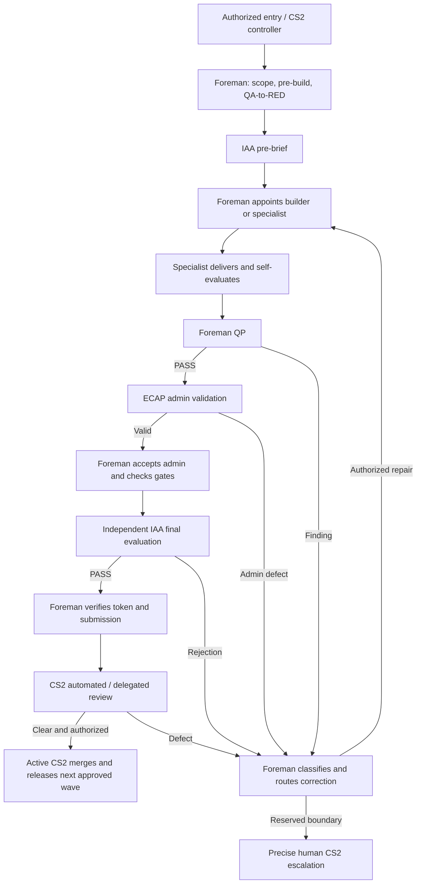

# Governance Failure Outengineering Strategy and Improvement Register

**System:** MATURION ISMS governance ecosystem (including PIT controller)  
**Human sponsor / ultimate authority:** Johan Ras (CS2)  
**Target automated authority:** Active CS2 review, correction routing, scoped PR merge and successor dispatch  
**Operational owner:** Foreman  
**Quality owner:** Foreman in Quality Professor (QP) mode  
**Administrative validation:** ECAP; **independent assurance:** IAA  
**Status:** Living strategy — proposed controls, documentation filing only; not implementation or merge approval  
**Version:** 1.3 — 2026-09-21; enforceability and safety-envelope edition  
**Repository home:** `governance/strategy/GOVERNANCE_FAILURE_OUTENGINEERING_STRATEGY.md`  
**Review cadence:** At every governed PR closure and monthly CS2 review  

### Authority and verified baseline

This strategy fits inside the existing governed workflow while proposing an explicitly authorized evolution of the CS2 role. Johan's current direction is that **CS2 must be able to review and merge PRs, but must not build**. Active CS2 will own final automated review, return defects to Foreman, perform authorized merges, and release the next approved wave. This replaces the advisory-only target in version 1.0; it does not claim the enabling changes are already live.

Filing this document does not itself change protected contracts, CANON, repository permissions or runtime behavior, appoint builders, or merge an existing PR. In this document, “must” describes target acceptance criteria unless explicitly identified as an existing rule. The enabling contract/CANON/permission change must be reviewed through the protected route; until it is merged and validated, current live restrictions remain enforced. Do not fake an authority upgrade through a prompt or a broader credential.

Live workflow references were inspected at `main` commit `058b6af0e352d33c262255465371b3fc94c5af99` on 2026-09-21:

- [Foreman Operating Model](https://github.com/APGI-cmy/maturion-isms/blob/058b6af0e352d33c262255465371b3fc94c5af99/FOREMAN_OPERATING_MODEL.md), especially sections 2, 4–8.
- [Foreman Tier 1 contract](https://github.com/APGI-cmy/maturion-isms/blob/058b6af0e352d33c262255465371b3fc94c5af99/.github/agents/foreman-v2-agent.md), invocation order and state machine.
- [IAA pre-brief protocol](https://github.com/APGI-cmy/maturion-isms/blob/058b6af0e352d33c262255465371b3fc94c5af99/.agent-admin/control/protocols/IAA_PREFLIGHT_BRIEF_PROTOCOL.md).
- [ECAP administrative boundary](https://github.com/APGI-cmy/maturion-isms/blob/058b6af0e352d33c262255465371b3fc94c5af99/.agent-admin/control/overlays/WAVE4_ECAP_ADMIN_BOUNDARY.md).
- [PIT pilot contract](https://github.com/APGI-cmy/maturion-isms/blob/058b6af0e352d33c262255465371b3fc94c5af99/.github/cs2-controller/pit-pilot.md) and [register schema](https://github.com/APGI-cmy/maturion-isms/blob/058b6af0e352d33c262255465371b3fc94c5af99/.github/cs2-controller/work-register.schema.json).
- [Interim CS2 contract](https://github.com/APGI-cmy/maturion-isms/blob/058b6af0e352d33c262255465371b3fc94c5af99/.github/agents/interim-cs2-agent.md): advisory review/routing only.

PR #2049 was still open at inspected head `c7e9e2cd1769e053691c3f82a48d883090125f4d`. This filing is not a proxy merge review of that PR. Its changes are not treated as merged policy. Historical failure coverage below comes from the supplied correction history, not a fresh end-to-end control audit.

## 1. Purpose and outcome

This strategy turns delivery failures into a measurable, continuously improving control system. Its target state is simple:

> An agent completes all work within its authority, independently changes from delivery mode to evaluation mode before every handover, corrects all in-sandbox defects, and escalates to CS2 only a proven protected, external, cost, destructive, or irreducible business-decision boundary.

The strategy applies to all governed work, including agent contracts, CANON, controller automation, QA, QP, ECAP, IAA, PR administration, and product delivery.

### Success criteria

1. No ordinary defect reaches human CS2 as a claimed-complete handover; automated CS2 review may detect and route escaped defects.
2. A valid final IAA PASS and `CS2_REVIEW` are the only normal delivery handback.
3. Admin-only activity can never restart a QP → ECAP → IAA cycle.
4. Every repeated failure has a named root cause, a permanent control, a test, and an owner.
5. Every governance rule has one unambiguous CANON source and machine-verifiable enforcement where practicable.

## 2. Non-negotiable operating principles

| Principle | Required behaviour |
|---|---|
| OPOJD | Foreman retains end-to-end orchestration responsibility while builders and specialists retain their separate roles; a checkpoint is not a terminal handover. |
| Delivery/evaluation separation | Before any handover, the delivering agent must enter explicit evaluation mode and assess the result critically. This is self-review, not independent IAA assurance. |
| Convergent remediation | `finding → classify → correct/delegate → test → re-evaluate` progresses within authorized retry and cost limits; no unlimited retry loop. The current pilot's one-formal-correction limit remains in force until explicitly changed. |
| STOP-and-Fix | A material defect stops progression immediately; correction must remove the cause, not merely document the symptom. |
| Fail Only Once | A recurrence is a governance defect. The corrective record must include a prevention control and regression test. |
| Minimum safe change | Correct only the smallest authority surface that solves the proven root cause; preserve unrelated contracts and product scope. |
| Evidence proportionality | Evidence must bind to a stable reviewed submission or external attestation. Evidence-only changes require deterministic checks, not a fresh assurance cycle. |
| Human boundary | Johan retains scope/authority expansion, protected authority changes, new cost/credential authority, destructive actions and irreducible business judgement. Routine PR review and merge within his approved mandate are delegated to active CS2 once its enabling governance and merge controls are operational. |

## 3. Existing workflow with target correction controls

The entry point is a human-CS2-authorized work request. Eligible PIT pilot work uses the existing **CS2 Work Request** Issue Form, with exact allowed paths, acceptance criteria, validation and dependencies. Broader governance waves use the existing human-authorized governance route until controller scope expansion is approved. Do not label a cross-cutting governance job as PIT merely to pass the pilot intake.

The controller validates intake and dispatches Foreman. Foreman bootstraps, loads the authority stack, scopes the work, aligns pre-build artifacts and confirms QA-to-RED before implementation. Foreman invokes IAA in PRE-BRIEF mode; IAA writes the canonical `## PRE-BRIEF` / `IAA_PREFLIGHT_BRIEF` in the wave record using the PR-scoped task record. Only then does Foreman appoint the appropriate builder or specialist.

The diagram describes orchestration and the target correction route, not proof that every transition is automated today. Pre-brief findings return to Foreman before appointment. A material scope/acceptance change requires updated pre-build/QA and, where necessary, amended pre-brief and authorization before implementation resumes.

### 3.1 Ownership of each fix loop

| Detection point | Correction owner and re-entry | Boundary preserved |
|---|---|---|
| Builder or specialist self-check | Same appointed specialist corrects within scope, tests, and self-evaluates before returning to Foreman | No claim of independent assurance |
| Foreman QP FAIL | Foreman issues bounded correction to the responsible builder/specialist; fresh evidence returns to Foreman QP | Foreman does not implement code or alter protected contracts |
| ECAP admin finding | ECAP returns admin fields/path/binding defects to Foreman; Foreman corrects authorized admin or delegates; ECAP revalidates only affected admin | ECAP cannot decide readiness, issue IAA rejection/verdicts, or invoke IAA |
| IAA rejection | IAA returns findings to Foreman; Foreman classifies, obtains repair, performs applicable QP/ECAP checks, and invokes independent IAA again when substantive assurance is affected | IAA does not fix the work it independently assures |
| Active CS2 review finding | CS2 returns a bounded STOP-and-Fix instruction to Foreman, tracks resolution, then rechecks the corrected submission | CS2 does not implement, replace independent IAA, or waive checks; it merges only after valid review and authorized conditions |
| Protected/external/cost/destructive/business boundary | Foreman proves the exact constraint and requests human CS2 decision; resume only within resulting authority | Codex Advisor requires the protected-change route and cannot edit its own contract |

An admin-only correction re-enters the affected deterministic check, not the entire build/QP/IAA chain. A substantive correction revalidates the affected work and receives independent assurance. Do not regenerate an unchanged valid pre-brief merely because a token was appended.

### 3.2 Final state and agent distinctions

`CS2_REVIEW` is quiescent for upstream delivery/assurance on the same valid reviewed submission: no producer or watchdog may restart pre-brief/build/QP/ECAP/IAA solely because a comment or valid token append occurred. Active CS2 must still perform its own final review and merge-eligibility check; PASS is not an automatic merge command. A material finding, substantive change, relevant base/dependency change, or invalidated evidence can reopen the affected lane with a recorded reason. A valid authorized CS2 review proceeds to `MERGE_AUTHORIZED → MERGED → CLOSED`; those are proposed semantic states to be mapped into the implemented schema, not states already deployed.

`READY_FOR_IAA` is retired as an ambiguous handover label. Where the system needs to state that final assurance is the next lawful step, it must use `IAA_ASSURANCE_REQUIRED`; that is a non-terminal, controller-owned state which cannot be returned to CS2 as completion. Existing occurrences must be migrated through the protected contract/CANON route and protected by a compatibility check that rejects the retired label in new task records, workflow guidance and agent handovers.

Human CS2 (Johan), the PIT controller, and `interim-cs2-agent` are currently distinct. The interim contract is advisory-only and returns findings or a `FOREMAN_REENTRY_PACKET`; the live pilot reserves merge to Johan. **These are current-state limitations to remove through the enabling wave, not permanent strategy restrictions.** Codex Advisor must propose the smallest CANON-consistent transition to an active CS2 contract and its Tier 2/3 controls, whether a governed successor contract or an expressly authorized upgrade. No silent repurposing or self-modification is permitted.

### 3.3 Active CS2 review and merge mandate

| Capability | Target authority | Safeguard |
|---|---|---|
| Final PR review | Inspect scope, completeness, tests/checks, conversations, dependency/base validity, Foreman QP, ECAP admin and canonical independent IAA | Evaluate actual evidence, not agent completion claims; record reviewed submission identity |
| Correction routing | Return defects to Foreman and track their resolution | CS2 must not implement the correction; Foreman appoints the appropriate specialist |
| PR merge | Merge routine work within the approved repository/wave/path mandate after all conditions pass | No blanket merge authority outside approved scope, no gate bypass and no assumption that IAA PASS alone is enough |
| Successor wave | Claim and dispatch the next explicitly approved work packet after verified merge/closure | One active PIT item until approved concurrency expansion; exactly-once claim and shared work-item budgets |
| Reserved decision | Escalate authority/scope expansion, new cost, destructive actions and genuine business decisions | CS2 cannot grant itself broader power or approve its own authority/guardrail change |

Before the merge call, CS2 must re-read the exact PR head/base, required checks and outstanding review threads; verify the independent IAA token binds the reviewed content and any permitted token-only delta; and ensure the merge action uses the reviewed head as a compare-and-set condition. A changed head or invalidated base cancels that merge attempt and routes the affected revalidation. Authenticate with the existing approved least-privilege integration; never bypass branch protections, impersonate an independent reviewer, or dismiss a substantive finding merely to merge.

After a timeout or repeated webhook, query whether the PR already merged before retrying. Record merge SHA and verified closure once. If a required independent review cannot be supplied by the configured identity, that is a proven permission/identity boundary, not a reason to relax review policy. A PR that changes CS2's own merge authority, safety breaker or escalation boundary remains human-approved; ordinary preauthorized PRs must not return to Johan merely for another routine merge click.

The initial enabling authority change is human-CS2-approved and independently assured. Its rollout begins with read-only/shadow merge decisions, exercises refusal cases, then enables scoped real merges. This filing is not an instruction to merge #2049 or any other existing PR now.

### 3.4 Machine-enforced active-CS2 merge policy

The enabled controller must evaluate a versioned, machine-readable **merge policy** before any merge call. It is a least-privilege allow-list, not a general permission to merge. Each policy decision must bind these facts:

| Policy field | Required rule |
|---|---|
| Repository and branch | Repository, base branch and approved wave/work-item must match an explicit allow-list. |
| Change surface | Changed paths and PR type must be within the packet's approved scope; protected-contract, CANON, safety-envelope or CS2-authority changes are human-CS2-approved only. |
| Reviewed identity | The PR head SHA, base SHA/mergeability, review timestamp and IAA reviewed-content binding must match the merge attempt. |
| Required conditions | Required checks complete and passing; no unresolved substantive review thread; valid Foreman QP, ECAP where applicable, and independent IAA PASS token; no active circuit breaker. |
| Compare-and-set | The merge API receives the exact reviewed head SHA. A changed head/base, conflict or required-check change invalidates the decision and prevents merge. |
| Refusal and escalation | Out-of-policy scope, missing evidence, unresolved identity, unavailable independent review, permission denial, or safety trip returns a typed refusal to Foreman or the precise human-CS2 boundary. It must never bypass a gate. |
| Audit and retry | Record one decision record and merge result. On timeout/webhook replay, read PR state first; retry only if it is still open, unchanged and within the idempotency key. |

W3 must supply policy-validation tests for every refusal condition. W4 must map the policy fields to the enabled CS2 Tier 1/2/3 authority and repository permission. Until both are independently assured, CS2 remains unable to execute a live merge.

## 4. Control architecture

### 4.1 Agent quality: prevent defects at source

Tier 1 contracts define mandatory authority, exit criteria, delivery-to-evaluation switch, and remediation ladder. Tier 2 protocols define exact procedures, state transitions, evidence rules, and escalation classification. Tier 3 task records bind the work to a specific PR, reviewed head, scope, evidence, and current state.

Every operational agent must have these standard obligations:

1. Read its scoped authority and current Tier 3 record before acting.
2. Work only on the authorised scope.
3. Run a pre-handover self-check in an explicitly different **evaluation mode**.
4. Record defects found by self-check and correct them before handover.
5. Consume every rejection itself; invoke the relevant specialist where that specialist owns the in-sandbox correction.
6. Escalate only with the exact protected rule or external dependency, evidence that normal remediation was exhausted, and the smallest requested decision.

### 4.2 Standard evaluation-mode self-check

The delivery agent must pause delivery and execute a “red-team self-check” before it changes state or hands work to another actor. The check must verify:

- authorised scope and correct repository/PR/work-item binding;
- completeness against every deliverable and acceptance criterion;
- current-main dependency/base requirements;
- substantive tests, focused regression tests, and check results;
- QP/ECAP/IAA evidence requirements and canonical token location;
- state-machine correctness, including terminal-state behaviour;
- no stale, historical, inherited, or unrelated context;
- no new admin loop, duplicate stage request, or evidence-refresh loop;
- no unexplained manual handoff where the agent has authority to proceed.

The self-check must emit a structured `PASS`, `STOP_AND_FIX`, or `PROVEN_EXTERNAL_BOUNDARY` disposition. “READY_FOR_IAA” and “ready for review” are not terminal dispositions.

The self-check record identifies the assessed submission, acceptance criteria, commands/results, defects found, corrections and outcome. Switching mode is an explicit checklist and evidence step, not a claim that the same agent has become an independent reviewer. Foreman QP and independent IAA remain separate controls.

### 4.3 Strengthened assurance layers

| Layer | New focus | Must reject |
|---|---|---|
| Foreman QP | Delivery completeness and execution reality | missing deliverables, unexecuted tests, stale base, premature handover, unclaimed in-sandbox correction |
| ECAP | Administrative coherence and transition legality | stale/foreign context, invalid evidence binding, missing canonical record, forbidden/duplicate transition |
| IAA | Independent effectiveness, CANON conformance, and non-recurrence | superficial evidence, unsafe escalation, contract/CANON contradiction, untested prevention control, assurance loop risk |
| Active CS2/controller | Final review, merge eligibility and whole-circle convergence | incomplete submission, invalid token/check binding, unresolved substantive thread, unauthorized merge, incorrect terminal guidance, repeated stage request or unclassified rejection |

No layer may merely report an ordinary in-sandbox defect. It must route it to the owner with a machine-readable classification and a required next action.

## 5. Admin-loop prevention: zero-tolerance workflow injection controls

Admin loops are a high-severity automation risk because they consume time, credits, assurance capacity, and confidence without increasing delivery quality. The following controls are mandatory.

| Control | Enforced rule |
|---|---|
| Single state evaluator | Controller, producer guidance, pre-handover, QP, ECAP, watchdog, and **every injection workflow** use the same authoritative PR-scoped state evaluator. A workflow may not infer “request pre-brief” from a file event alone. |
| Finite state machine | Preserve Foreman's `BOOTSTRAP → PREFLIGHT_LOCKED → IAA_PREBRIEF_READY → BUILD_DELEGATED → BUILDER_HANDOVER_RECEIVED → FOREMAN_QP_PASS → ECAP_ADMIN_VALIDATED → PRE_HANDOVER_GATE_PASS → IAA_FINAL_PASS → CS2_REVIEW`. Add explicit authorized CS2 review/merge/closure and successor transitions in the enabling schema change. No hidden bypass of intermediate gates. |
| Delta classifier | Classify actual diff semantics and provenance, not filename or author label. Substantive, rebase and gate/workflow changes require affected revalidation. A verified token-only append/comment permits deterministic validation; altered verdict/scope/evidence is not automatically admin-only. Unknown deltas block progression pending classification. |
| Stage idempotency | Stage keys bind work item, PR, reviewed content/base, stage and relevant validated input revision. An atomic claim prevents concurrent duplicate dispatch. Unchanged events are no-ops; a repaired admin input may revalidate that admin check without reopening IAA. |
| Terminal guard | Apply the terminal guard only after current blocking facts are evaluated. A real failed/pending/missing required gate, merge/base conflict, identity mismatch, substantive change, or invalidated evidence must return the specific `STOP_AND_FIX`/revalidation route; a recorded PASS must never mask it. |
| Loop detector | Stop repeated agent dispatch without meaningful input/progress change. Deduplicate both the action and its alert. An admin-only event must never create a new assurance cycle. |
| Budget/time circuit breaker | A deterministic supervisor outside the agent loop enforces approved attempt, active-runtime and spend ceilings; cancel active dispatch and disable automatic retries on trip. If cost telemetry is unavailable, use conservative run/time limits. Never use repeated model calls to decide whether to stop spending. Resume needs a classified repair and authorized, audited reset; no self-reset on another webhook. |
| Injection library | Standard workflow injections: `STOP_AND_FIX`, `SELF_REMEDIATE`, `SPECIALIST_DELEGATION`, `PROVEN_EXTERNAL_BOUNDARY`, `TERMINAL_PASS_GUARD`, and `LOOP_BREAK`. |

Each control requires a regression test, including a property test that admin-only events cannot form a cycle.

**Terminal precedence rule:** `STOP_AND_FIX` for a current material condition takes precedence over `CS2_REVIEW`; `CS2_REVIEW` takes precedence only over redundant pre-brief/assurance ceremony for an otherwise valid unchanged submission. All event sources must call the same precedence function. The regression suite must use the real workflow entrypoints, not only an extracted renderer/evaluator, and prove both directions: (a) final PASS never emits a pre-brief request; (b) final PASS never hides a new failed gate or merge conflict.

The current pilot allows one formal correction; a further material correction requires closure and a smaller recut under its existing rules. This strategy cannot expand that limit. Recut attempts must share the parent work-item budget so changing PRs cannot reset the cost/loop breaker. W0 must specify approved numeric limits before unattended operation; none are claimed configured by this filing.

### 5.1 Safety envelope and human kill switch

No unattended controller may act without a versioned **safety envelope** bound to the work item. The envelope is configured once by an authorised human-CS2 decision, is readable by every workflow, and is enforced by a supervisor that is independent of the delivery agents. Its minimum fields are:

`work_item_id, approved_paths, approved_agents, maximum_active_jobs, maximum_stage_attempts, maximum_remediation_attempts, maximum_dispatch_runtime, maximum_total_runtime, maximum_spend, maximum_merge_attempts, expiry, circuit_breaker_state, reset_authority, kill_switch_state`.

The implementation must fail closed when the envelope is absent, expired, malformed, inconsistent with the task record, or unable to measure a configured limit. The **human kill switch** disables new dispatches, retries, merges and successor release immediately while preserving evidence; it must be usable without another agent run. A trip produces exactly one `LOOP_BREAK`/`BUDGET_TRIP` decision, cancels or safely abandons active automation, and requires a classified incident repair plus an authorised audited reset. It may not reset itself because a new comment, token, PR, or webhook arrives.

W0 must propose numeric defaults and refusal behaviour for approval. The starting values must be deliberately conservative and tested with a simulated 24-hour repeated event; this strategy does not silently grant any spending ceiling.

### 5.2 Authoritative event decision record

Every controller, injector, watchdog, QP/ECAP transition and CS2 merge decision must read and append the same PR-scoped decision record. This record is the factual interface between agents; prose comments are evidence, not a substitute for state. At a minimum each event records:

`event_id, received_at, source, work_item_id, pr_number, head_sha, base_sha, reviewed_content_fingerprint, state_before, material_blockers, delta_class, requested_stage, allowed_next_action, action_owner, idempotency_key, attempt_count, safety_envelope_id, budget_snapshot, decision, reason_code, evidence_refs, state_after`.

The evaluator must be deterministic: the same input and record returns the same decision. Unknown/missing facts return a typed `STOP_AND_FIX` or `PROVEN_EXTERNAL_BOUNDARY`; they never infer readiness. Decision records are append-only, integrity-checked and retained across rebases/recuts under the parent work-item identity so a new PR cannot erase history, recurrence counts or safety budgets.

## 6. Failure improvement register

This table is the initial baseline. Update it for every material failure, near miss, repeat, or control improvement.

“Current coverage” records the earlier PR-review history as a hypothesis for W0 verification. It is not a fresh test result or a claim that all controls are live on the inspected main. W0 must attach current control/test evidence and correct stale statuses before any entry becomes VERIFIED.

| ID | Failure pattern | Root cause class | Permanent prevention | Detection owner | Current coverage | Target state |
|---|---|---|---|---|---|---|
| FO-001 | Stale/global pre-brief context affects active work | Context binding | PR/work-item-scoped resolver; reject foreign/historical state | Controller, ECAP | Implemented foundation | machine gate |
| FO-002 | Unsafe issue/PR claim or binding | Intake/binding | exact form parser; trusted actor; marker/repository checks; pagination; one binding | Controller, QP | Implemented foundation | machine gate |
| FO-003 | Foreman hands back at an internal checkpoint | Agent behaviour | remediation ladder; mandatory self-check; no `READY_FOR_IAA` terminal state | Foreman QP, controller | Contract hardening in progress | runtime enforced |
| FO-004 | Tier-1 contract/CANON path contradiction | Governance alignment | single CANON owner; contract-to-CANON parity test; surgical reconciliation process | IAA | Path repair completed | parity gate |
| FO-005 | Assurance becomes stale after rebase | Evidence freshness | base/ancestor validation before final assurance | QP, IAA | Procedural | machine gate |
| FO-006 | PASS token exists only in comments/evidence | Canonical evidence | canonical `## TOKEN` presence/binding check | ECAP, IAA | Partial | hard gate |
| FO-007 | Agent contract cannot load due to metadata schema | Artifact validity | frontmatter/schema/limit validation before PR review | QP | Implemented foundation | hard gate |
| FO-008 | PR contains partial wording but misses required artefacts/tests | Delivery completeness | manifest with required files/tests; task completion derives from proof, not assertion | Foreman QP | Partial | hard gate |
| FO-009 | Dependency PR/foundation not integrated | Dependency control | required foundation SHA must be an ancestor before completion | Controller, QP | Missing | hard gate |
| FO-010 | Stale or incomplete QP/ECAP/IAA chain | State transition | one state evaluator; valid evidence prerequisites for each transition | ECAP, controller | Partial | hard gate |
| FO-011 | Exact-HEAD evidence causes evidence-only cycle | Evidence model | stable reviewed-head/external attestation rule | IAA, ECAP | Contract improvement | hard gate |
| FO-012 | Guidance asks for pre-brief after final PASS | Terminal-state defect | terminal guard plus post-PASS regression test in every event source | Controller | Partially repaired; separate injector still failed | hard gate |
| FO-013 | Repeated admin loop consumes credits/time | Automation safety | idempotency, loop detector, circuit breaker, `LOOP_BREAK` injection | Controller | Missing | hard gate + alert |
| FO-014 | Strategy omits pre-brief, role return paths, or pilot limits | Workflow design | authoritative workflow trace and role/limit review before filing | Foreman QP, IAA | Corrected in strategy v1.1; runtime not changed | contract-to-plan trace gate |
| FO-015 | Event-specific pre-brief injector bypasses terminal state and posts a fresh request after final PASS | Workflow-injection divergence | all injection entrypoints must call the common state/precedence evaluator; integration test invokes the actual injector with a final-PASS PR snapshot and asserts zero pre-brief comment | Controller, QP | Observed on #2049 head `c7e9e2c`; OPEN | hard gate + integration test |
| FO-016 | Terminal PASS guard masks an actual failed gate or unresolved merge conflict | Unsafe state precedence | evaluate material blockers before terminal suppression; test failed gate and merge conflict against the actual checkpoint entrypoint | Controller, QP, IAA | Observed on #2049 head `c7e9e2c`; OPEN | hard gate + negative-path integration tests |

### Required entry for every new failure

`FO-### | date | work item/PR | observed behaviour | impact | root cause | classification | containment | permanent control | test/gate | earliest expected detection layer | actual detection layer | escape explanation | owner | status | recurrence count | evidence links`

Lifecycle: OPEN → CONTAINED → SCHEDULED → IMPLEMENTED → VERIFIED → CLOSED; any recurrence becomes REOPENED with an incremented recurrence count. Scheduling a control is not closure. Close only with implemented prevention, passing relevant regression evidence, independent verification, and an identified owner. Keep date, PR and evidence links with every transition.

### 6.1 Mandatory failure escape analysis

Every new failure, near miss, false PASS and circuit-breaker trip must answer these questions before its control can close:

| Question | Required use |
|---|---|
| Where should this first have been caught? | Name the earliest practical layer: delivery self-check, Foreman QP, ECAP, IAA, controller/CS2, or merge policy. |
| Where was it actually caught? | Record the real detecting actor/gate and the exact evidence. |
| Why did it escape? | Classify the gap: missing control, control not invoked, incorrect state/context, insufficient test, authority ambiguity, or human/agent execution error. |
| What was the impact? | Record remediation cycles, time, model/spend estimate where available, assurance capacity, affected PRs and whether an unsafe merge was prevented. |
| What changes now? | Link the smallest preventive control, regression/gate ID, owner, target wave and validation evidence. |

Monthly CS2 review must publish the top escape paths and recurrence/cost trend. A layer that repeatedly catches defects late is evidence that its upstream control is weak; it must trigger a STOP-and-Fix improvement task, not be celebrated as a successful late catch.

## 7. CANON alignment rules

1. Create a CANON control map linking each strategy requirement to Tier 1, Tier 2, Tier 3, controller implementation, QP, ECAP, IAA, tests, and the authoritative CANON entry.
2. A Tier 1 change must identify all necessary Tier 2/3 and CANON ripples before merge.
3. A parity gate must fail when a protected contract, its required protocol, or its CANON entry disagree on state, authority, terminal conditions, or escalation rule.
4. The strategy does not weaken independent assurance. It makes IAA more effective by ensuring it detects and routes defects without creating ceremony loops.
5. Protected-contract edits remain surgical and require the established governance route; normal in-sandbox remediation remains Foreman-owned.
6. This repository is a CANON consumer. Resolve upstream authority and controlled layer-up/layer-down before edits; do not mutate consumer CANON to make a local strategy appear compliant. W4 alignment participates in every wave's design and merge gate, not only a later cleanup wave.

## 8. Wave implementation plan

Each implementation wave follows section 3: authorized entry → Foreman/pre-build/QA-to-RED → IAA pre-brief → appointment → specialist implementation/self-check → Foreman QP → ECAP where applicable → Foreman gates → final IAA → Foreman → CS2 review/merge. This document files the plan; it does not dispatch these waves.

The current PIT pilot accepts only one active work item until its row is `closed`. Keep that limit. Independent design/test preparation can overlap within a separately authorized plan and disjoint ownership, but multiple active PIT controller jobs cannot. A cross-cutting governance wave does not fit the PIT-only form without approved expansion. Protected contract work in W1/W2/W4 must use Codex Advisor with CS2 authorization; all implementation goes to the appropriate builder/specialist, never to Foreman or interim CS2.

| Wave | Scope and key deliverables | Dependencies | Safe concurrency | Accountable route | Completion proof |
|---|---|---|---|---|---|
| W0 — Baseline and containment | Verify register/control evidence; define and implement approved safety envelope, loop/spend limits, human kill switch and decision-record schema; incident containment | Exact authorized scope and current dependencies | Register/design preparation only while containment is pending | Human CS2 → Foreman → appointed specialist | tested breaker and kill switch, approved numeric limits, decision-record validation, truthful baseline |
| W1 — Agent self-check and remediation | Tier 1/2/3 evaluation switch; remediation ladder; self-check schema; replace `READY_FOR_IAA` with `IAA_ASSURANCE_REQUIRED` | W0 containment; disposition of #2049; W4 authority map | W2/W3 design only, with no overlapping files; pilot execution remains serial | Foreman → Codex Advisor for protected edits; appropriate builders otherwise | contract/protocol tests, retired-label compatibility gate and rejected-job demonstration |
| W2 — Assurance uplift | QP manifest; ECAP evidence/transition validation; IAA non-recurrence checks | W0; frozen W1 interface; W4 alignment | Disjoint test/design work with W3, if separately authorized | Foreman → authorized specialists | seeded failure suite caught by correct assurance layers |
| W3 — Controller state, merge and loop safety | shared evaluator and terminal-precedence function for all event sources; idempotency; delta/terminal controls; injections; decision-record store; safety-envelope supervisor; scoped review/merge adapter and successor queue | W0; controller foundation; frozen W1/W2 interfaces; approved W4 active-CS2 authority | Test/design with W1/W2; one active pilot job; shared evaluator changes serialized | Foreman → appointed controller/QA builders | actual-injector final-PASS test emits zero pre-brief request; checkpoint rejects failed-gate/merge-conflict despite recorded PASS; unsafe/stale/self-authorizing merge refused; duplicate/reordered events; decision record deterministic; kill switch and simulated 24-hour repeat stop without live spending |
| W4 — Active CS2 authority and CANON alignment | active review/merge contract plus Tier 2/3 controls; machine-enforced merge-policy map; control map; upstream/consumer parity; #2041 reconciliation | Start inventory at W0; human approval and independent assurance of enabling authority before activation | Cross-cutting design lane with W1–W3; shared protected files serialized | Human CS2 → authorized Codex Advisor / governance layer-down route | authority/permission/parity evidence per wave; merge-policy refusal suite; final audit before W5 |
| W5 — Integrated two-wave pilot | Two bounded, preauthorized PIT-compatible work packets; rejection, token append, active CS2 review/merge and successor exercises | W1–W4 verified and merged; active controller authority, merge permissions and queue tests established | Two pilot packets execute strictly sequentially | Active CS2 → Foreman → specialists → Foreman → active CS2 review/merge | first packet independently assured, CS2-reviewed, CS2-merged and closed before exactly-once dispatch of second |
| W6 — Scale and continuous review | Expand only after pilot proof; monthly recurrence review | W5; separate module/concurrency authorization | Independent module lanes only when authorized and supported | CS2 → controller/Foreman | adoption evidence, metrics, enforced aggregate budgets |

### Two-wave CS2 orchestration trial

After W0–W4 provide a validated active CS2/controller, prepare two exact work packets under W5. Both require human CS2 authorization of scope, allowed paths, acceptance tests, cost limits, delegated merge authority, dependencies and queue order. They must be genuinely PIT-compatible under the pilot, or wait for approved controller-scope expansion. Use only the governed active-CS2 identity, not an advisory identity operating beyond its contract.

1. Packet A exercises self-check, QP, one authorized rejection/correction, ECAP, independent final IAA, then active CS2 review and scoped merge. Its exact scope is frozen before intake.
2. Packet B exercises dependent intake, admin-only token handling and terminal-state safety on the merged A baseline. It remains queued until A is independently assured, CS2-reviewed and CS2-merged, post-merge requirements satisfied, and the active register row is `closed`.
3. Only then may the implemented controller atomically claim B and dispatch Foreman once, without a new routine “please continue” request or human merge click. IAA PASS alone does not authorize merge, closure, or successor dispatch; active CS2 must first complete its separate review and merge checks.
4. Failed/rejected/abandoned A does not advance B. A budget trip or changed scope pauses dispatch. Queue progress cannot bypass existing correction limits or create a second active PIT job.

These are planned work packets, not assignments already posted. This staged trial avoids relying on an unimplemented automatic-next-wave capability to implement itself. W1–W4 may be orchestrated through the existing human-authorized route while independent preparation runs concurrently.

## 9. Measurement and review

| Metric | Target | Review action if missed |
|---|---|---|
| Ordinary defects reaching claimed-complete human CS2 handover | 0 | STOP-and-Fix root-cause review within one governed cycle |
| Repeat of a closed failure pattern | 0 | Reopen the failure entry as governance non-conformance; add/strengthen gate |
| Valid self-check before handover | 100% | block transition |
| Final assurance complete before `CS2_REVIEW` | 100% | block terminal transition |
| Admin-loop attempts stopped automatically | 100% | incident review and regression expansion |
| Duplicate stage requests | 0 executed; all detected | investigate state evaluator/idempotency breach |
| Escalations lacking proven external/protected boundary | 0 | return to Foreman with `SELF_REMEDIATE` injection |
| Mean remediation cycles per job | declining trend | analyse top recurring patterns monthly |
| Safety-envelope or kill-switch trip | 0 avoidable trips; 100% immediate containment | post-incident review, no automated reset, and regression expansion before resumption |
| Escaped defect detection gap | declining earliest-to-actual detection distance | strengthen the earliest failed layer and record escape analysis |
| Merge-policy refusal correctness | 100% of seeded unsafe merges refused | STOP-and-Fix merge policy and authority mapping |

## 10. Governance cadence and change control

- **Per finding:** add/refresh the failure-register entry before the next handover.
- **Per PR:** self-check result, QP/ECAP/IAA dispositions, and any workflow injection are bound to the PR-scoped Tier 3 record.
- **Monthly:** CS2 reviews metrics, recurrence, circuit-breaker events, and the highest-risk unresolved controls.
- **Quarterly:** review CANON parity, agent contract effectiveness, and whether controls can be simplified without reducing assurance.
- **After every incident:** perform a bounded post-incident review; add a regression test before the same class can re-enter normal flow.

## 11. Immediate next actions

1. File this documentation-only strategy through a draft PR; independently review it before adoption. No protected contract or runtime changes are included in the filing.
2. Recheck #2049's latest repair and assurance through its existing lane; do not duplicate that work or treat an open PR as merged authority.
3. Prepare W0 containment and the W4 active-CS2 review/merge authority package for approval; freeze paths, numeric limits, refusal tests and ownership before implementation. Keep this enabling change human-approved and independently assured.
4. Prepare W1/W2/W3 with explicit dependencies and safe parallel preparation, preserving the one-active-PIT-job limit.
5. Once controller safety and active-CS2 review/merge authority are proven, authorize the two W5 work packets and verify review → merge → closure → next-wave dispatch without routine human intervention.

## 12. Decision record

The current user instructions authorize repository filing, workflow alignment, and the strategic change from advisory-only CS2 to **active PR review and merge authority, with no building**. They do not identify an existing PR to merge or directly amend a protected contract/CANON. Record the enabling protected change, scoped permissions and wave approvals through the established route before activation. No control is complete merely because it is described; completion requires enforced prevention/detection and relevant verification evidence.

| Version | Date | Change | Disposition |
|---|---|---|---|
| 1.0 | 2026-09-21 | Initial strategy and failure baseline | Document created; not repository-filed |
| 1.1 | 2026-09-21 | Explicit pre-brief/appointment/Foreman return paths, per-stage fix routing, active CS2 review/merge target, protected enabling route, pilot limits and safe successor gate | Documentation filing requested; enabling implementation remains pending |
| 1.2 | 2026-09-21 | Recorded PR #2049 terminal-state failures FO-015/FO-016; made all injector paths and material-blocker precedence mandatory W3 controls | Strategy update pending in PR #2050; runtime repair required in PR #2049 |
| 1.3 | 2026-09-21 | Added a mandatory safety envelope and human kill switch, authoritative event decision record, machine-enforced active-CS2 merge policy, failure escape analysis, explicit terminal precedence and `READY_FOR_IAA` retirement | Strategy update pending in PR #2050; no runtime authority or limit is activated by this documentation change |
